# Event Modeling — Gestion Immo

Ce document décrit les flux d'événements du domaine en suivant l'approche **Event Modeling**
(Adam Dymitruk). Les éléments suivent la convention :

- **Command** (bleu) : intention de l'utilisateur
- **Event** (orange) : fait métier immuable
- **Read Model** (vert) : projection lisible
- **UI** (gris) : interface qui déclenche / consulte

## Slice : Création d'un bien

Un agent immobilier saisit les informations d'un bien à mettre en gestion. Le système
valide l'unicité de la référence puis enregistre le bien et publie un événement
`BienCree` qui alimente la liste des biens.

### Diagramme

```mermaid
flowchart LR
    UI["UI<br/>Formulaire 'Nouveau bien'"]:::ui
    CMD["Command<br/>CreerBien"]:::cmd
    AGG{{"Aggregate<br/>Bien"}}:::agg
    EVT["Event<br/>BienCree"]:::evt
    RM["Read Model<br/>ListeDesBiens"]:::rm
    UIL["UI<br/>Tableau des biens"]:::ui

    UI -- "soumet" --> CMD
    CMD -- "valide & exécute" --> AGG
    AGG -- "émet" --> EVT
    EVT -- "projette" --> RM
    RM -- "alimente" --> UIL

    classDef ui fill:#e0e0e0,stroke:#666,color:#000
    classDef cmd fill:#3b82f6,stroke:#1d4ed8,color:#fff
    classDef agg fill:#a855f7,stroke:#6b21a8,color:#fff
    classDef evt fill:#f97316,stroke:#c2410c,color:#fff
    classDef rm fill:#22c55e,stroke:#15803d,color:#fff
```

### Détails

#### Command — `CreerBien`

| Champ            | Type        | Contraintes                                      |
|------------------|-------------|--------------------------------------------------|
| `reference`      | `String`    | obligatoire, unique                              |
| `adresse`        | `String`    | obligatoire                                      |
| `type`           | `TypeBien`  | enum (`APPARTEMENT`, `MAISON`, `TERRAIN`, …)     |
| `surface`        | `double`    | strictement positive (m²)                        |
| `prixEnCentimes` | `long`      | ≥ 0 (montant en centimes EUR)                    |

#### Event — `BienCree`

| Champ            | Type        |
|------------------|-------------|
| `bienId`         | `UUID`      |
| `reference`      | `String`    |
| `adresse`        | `String`    |
| `type`           | `TypeBien`  |
| `surface`        | `double`    |
| `prixEnCentimes` | `long`      |
| `creeLe`         | `Instant`   |

#### Read Model — `ListeDesBiens`

Projection alimentée par `BienCree`. Permet :
- l'affichage paginé du portefeuille,
- la recherche par référence/adresse,
- les filtres par type et tranche de prix.

### Règles métier

1. La `reference` doit être unique sur l'ensemble du portefeuille.
2. La `surface` doit être strictement positive.
3. Le `prixEnCentimes` ne peut pas être négatif.
4. La création d'un bien est une opération idempotente côté UI : un retry sur la même
   référence renvoie une erreur `409 Conflict` côté API.

### Mapping vers le code (architecture hexagonale)

| Concept event modeling | Artefact backend                                                                    |
|------------------------|--------------------------------------------------------------------------------------|
| Command `CreerBien`    | `domain/port/in/CreerBienUseCase.CreerBienCommand`                                   |
| Use case               | `application/service/BienService#creer`                                              |
| Aggregate `Bien`       | `domain/model/Bien` (record immuable, invariants dans le compact constructor)        |
| Port sortant           | `domain/port/out/BienRepository`                                                     |
| Adapter persistance    | `adapter/out/persistence/BienRepositoryAdapter` + `BienEntity` + `BienJpaRepository` |
| Adapter web            | `adapter/in/web/BienController` (`POST /api/biens`)                                  |
