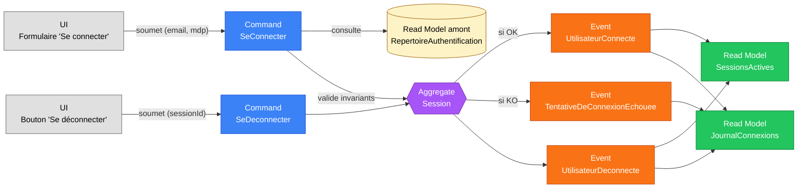

# Slice — Authentification

> **Mode** : Orchestration Métier (cf. `MISSION.md`). Analyse métier uniquement, pas de code.
>
> **Statut** : *Slice métier **validé**. Dernier slice avant bascule en mode implémentation.*

## 1. Décisions actées

| #   | Décision                                                                                                                                       |
|-----|------------------------------------------------------------------------------------------------------------------------------------------------|
| D1  | **Périmètre minimal en V1** : login (`SeConnecter`) et logout (`SeDeconnecter`) uniquement. Pas de récupération de mot de passe, pas de MFA, pas de verrouillage après échecs, pas de « remember me ». Tout cela = slices ultérieurs. |
| D2  | **Token opaque** (chaîne aléatoire ≥ 128 bits d'entropie) **stocké hashé côté serveur** (sha-256). Pas de JWT. Avantage : révocabilité instantanée et simplicité.                                                       |
| D3  | **Durée de session : 24 h fixes** depuis l'émission. **Pas de rotation glissante** en V1 (`expireA` figé). Après expiration, l'utilisateur doit se reconnecter.                                                          |
| D4  | **Multi-session autorisée** : un même utilisateur peut détenir plusieurs sessions actives simultanément sur des appareils différents.                                                                                  |
| D5  | **Rétention de `ipSource` + `userAgent` dans `JournalConnexions` : 12 mois** glissants, puis purge automatique. Implémentation effective dans le slice « RGPD » futur ; en V1 on conserve simplement le besoin documenté. |
| D6  | **Login non subordonné à un email vérifié** en V1 (cohérent avec D3 du slice utilisateur : statut `ACTIF` direct à l'inscription).                                                                                       |
| D7  | **Anti-énumération stricte** : la réponse API en cas d'échec est strictement identique quel que soit le motif (email inconnu, mauvais mot de passe, compte inactif). Côté serveur, l'événement `TentativeDeConnexionEchouee` porte le motif détaillé pour audit. Un dummy hash argon2id est exécuté sur le chemin « email inconnu » pour garantir un temps de réponse constant. |
| D8  | **Aggregate `Session` distinct de `Utilisateur`** : la session porte son propre cycle de vie (création, déconnexion, expiration). Les invariants transverses (rate limiting, multi-session) sont gérés par des services applicatifs / projections, pas par l'aggregate. |
| D9  | **`TentativeDeConnexionEchouee` émis dès la V1**. C'est un fait métier de sécurité utile (audit, futures alertes, journal d'accès) et le coût est faible.                                                                |
| D10 | **Révocation forcée par d'autres slices** (changement de mot de passe, suspension de compte, etc.) sera modélisée comme **réaction** (process manager / saga) qui émet `UtilisateurDeconnecte(motif = REVOQUEE)` pour chaque session active de l'utilisateur. Mécanique à modéliser dans le slice consommateur, pas ici. |

## 2. Contexte et finalité métier

Les slices précédents posent que toute action métier (créer un bien, compléter son profil) est exécutée par un **utilisateur connecté**. Le slice « Création d'un Utilisateur » a produit un compte capable de se connecter ; il manque encore le mécanisme d'**ouverture et de fermeture de session**.

Ce slice est délibérément **court et focalisé** : il débloque l'implémentation des slices déjà validés (Création d'un Bien, Création d'un Utilisateur, Enrichissement du Profil) en fournissant le contexte d'authentification dont ils ont besoin (`utilisateurId` courant).

## 3. Dépendances de slices

| Slice                                       | Position    | Pourquoi                                                                              |
|---------------------------------------------|-------------|---------------------------------------------------------------------------------------|
| **Création d'un Utilisateur** (amont)       | Validé      | Fournit le hash de mot de passe et l'`utilisateurId` que l'authentification consomme.|
| **Authentification** (ce slice)             | —           | —                                                                                     |
| **Récupération de mot de passe** (aval)     | À modéliser | Flow « mot de passe oublié », hors V1.                                               |
| **Changement de mot de passe** (aval)       | À modéliser | Mise à jour du hash + révocation des sessions (D10), hors V1.                        |
| **Sécurité du compte** (aval)               | À modéliser | Verrouillage après échecs répétés, MFA, alertes — hors V1.                           |
| **Vérification d'email** (aval)             | À modéliser | Reste optionnelle ; si introduite plus tard, pourra subordonner le login.            |
| **RGPD** (aval, D5)                         | À modéliser | Purge automatique du `JournalConnexions` au-delà de 12 mois.                          |

## 4. Périmètre

- **Inclus** : login par email + mot de passe, logout volontaire, suivi des sessions actives, traçabilité des tentatives échouées.
- **Exclus** : récupération / changement de mot de passe, MFA, OAuth/SSO, verrouillage du compte, « remember me », signature unique multi-applications, purge automatique RGPD.

## 5. Acteurs

| Acteur                       | Rôle                                                                              |
|------------------------------|-----------------------------------------------------------------------------------|
| **Utilisateur inscrit**      | Soumet ses identifiants pour ouvrir une session ; déclenche la fermeture quand il le souhaite. |
| **Visiteur (non inscrit)**   | Peut tenter une connexion ; donnera lieu à un échec.                              |

## 6. Ubiquitous language

| Terme                          | Définition métier                                                                                  |
|--------------------------------|----------------------------------------------------------------------------------------------------|
| **Session**                    | Période pendant laquelle un utilisateur est considéré comme authentifié. Identifiée par un `sessionId`. |
| **Token de session**           | Chaîne aléatoire opaque (≥ 128 bits) remise au client. Côté serveur, seul son hash est conservé (D2). |
| **Connexion (login)**          | Action d'ouvrir une session.                                                                       |
| **Déconnexion (logout)**       | Action de fermer volontairement une session.                                                       |
| **Tentative de connexion**     | Soumission d'identifiants — peut aboutir à un succès ou à un échec.                                |
| **Échec de connexion**         | Tentative refusée (identifiants invalides ou compte inactif). Émet `TentativeDeConnexionEchouee`. |
| **Expiration de session**      | Fin implicite quand `now ≥ expireA` (24 h après ouverture, D3).                                   |
| **Révocation de session**      | Fin explicite décidée côté serveur (ex. force-logout suite à changement de mdp). Modélisée comme réaction dans les slices consommateurs (D10). |

## 7. Diagramme Event Modeling

## 8. Commands

### 8.1. `SeConnecter`

| Champ                  | Type             | Origine          | Contraintes                                                                                |
|------------------------|------------------|------------------|--------------------------------------------------------------------------------------------|
| `email`                | `Email`          | UI               | Normalisé (lowercase + trim) avant lookup dans `RepertoireAuthentification`.              |
| `motDePasseClair`      | `String`         | UI               | **Jamais persisté ni loggué.** Comparé au hash via argon2id puis détruit immédiatement.    |
| `userAgent`            | `String?`        | Header HTTP      | Optionnel, conservé dans l'événement à des fins d'audit (D5).                             |
| `ipSource`             | `String?`        | Couche transport | Optionnel, conservé dans l'événement (D5 : rétention 12 mois).                            |

Sortie attendue côté API en cas de succès : `sessionId` + `tokenSession` (en clair, transmis **une seule fois**) + `expireA`. En cas d'échec : message générique strictement identique quel que soit le motif (D7).

### 8.2. `SeDeconnecter`

| Champ                  | Type             | Origine          | Contraintes                                                                                |
|------------------------|------------------|------------------|--------------------------------------------------------------------------------------------|
| `sessionId`            | `SessionId`      | Contexte d'auth  | Doit correspondre à une session active appartenant à l'utilisateur appelant (I-6).        |

## 9. Events

Tous portent un horodatage technique `survenuLe : Instant`.

| Événement                          | Émis quand…                                                                                  | Charge utile principale                                                                          |
|------------------------------------|----------------------------------------------------------------------------------------------|--------------------------------------------------------------------------------------------------|
| `UtilisateurConnecte`              | Succès de `SeConnecter`.                                                                     | `sessionId`, `utilisateurId`, `expireA : Instant`, `userAgent?`, `ipSource?`.                   |
| `TentativeDeConnexionEchouee`      | Échec de `SeConnecter`.                                                                      | `emailSoumis` (normalisé), `raison ∈ {IDENTIFIANTS_INVALIDES, COMPTE_INACTIF}`, `userAgent?`, `ipSource?`. **Pas d'information** indiquant si l'email existait. |
| `UtilisateurDeconnecte`            | Succès de `SeDeconnecter`, expiration, ou révocation côté serveur (D10).                     | `sessionId`, `utilisateurId`, `motif ∈ {VOLONTAIRE, EXPIRATION, REVOQUEE}`.                    |

## 10. Read Models

### 10.1. `SessionsActives`

Index `sessionId → (utilisateurId, expireA, tokenSessionHash, userAgent?, ipSource?, derniereActiviteLe?)`. Consommé à chaque requête authentifiée pour valider le token et résoudre l'utilisateur courant.

- Le token de session n'est **jamais** stocké en clair (D2).
- Une session est *active* tant que `now < expireA` **et** qu'aucun `UtilisateurDeconnecte` n'a été émis pour son `sessionId`.

### 10.2. `JournalConnexions`

Read model historique alimenté par `UtilisateurConnecte`, `TentativeDeConnexionEchouee`, `UtilisateurDeconnecte`. Usages :

- Historique de connexions/tentatives par utilisateur (slice UI futur).
- Détection d'anomalies (slice « Sécurité du compte » futur).
- Conformité RGPD : purge au-delà de 12 mois (D5, implémentation en slice RGPD).

## 11. Invariants & règles

1. **I-1** Lookup de l'email **après normalisation** (lowercase + trim) dans `RepertoireAuthentification`.
2. **I-2** Si l'email n'existe pas **ou** si le hash du mot de passe ne correspond pas : émission d'un `TentativeDeConnexionEchouee` avec `raison = IDENTIFIANTS_INVALIDES`. Réponse API **identique** dans les deux cas (D7). Un dummy hash argon2id est exécuté sur le chemin « email inconnu » pour timing constant.
3. **I-3** Si le compte existe mais que son `statut ≠ ACTIF` : `TentativeDeConnexionEchouee` avec `raison = COMPTE_INACTIF`, réponse API identique (D7).
4. **I-4** À chaque succès : génération d'un `tokenSession` cryptographiquement aléatoire (≥ 128 bits). Le token est transmis au client **une seule fois** ; seul son hash est conservé serveur.
5. **I-5** `expireA = now + 24 h` (D3). Pas de rotation glissante.
6. **I-6** `SeDeconnecter` ne peut viser que **la session courante de l'appelant**. Refus si le `sessionId` désigne une session d'un autre utilisateur.
7. **I-7** Une session expirée ou révoquée ne peut pas être réactivée. L'utilisateur doit re-soumettre `SeConnecter`.
8. **I-8** Le `motDePasseClair` ne quitte jamais l'aggregate de la commande : pas de log, pas de stack trace, pas de message d'exception le contenant.
9. **I-9** Multi-session autorisée (D4) : un même utilisateur peut détenir plusieurs sessions actives sur des appareils différents. Aucun invariant n'invalide une session quand une autre s'ouvre.

## 12. Sécurité — points non négociables

- **Anti-énumération** (D7) : réponse API strictement identique quel que soit le motif d'échec ; dummy hash sur email inconnu pour timing constant.
- **Rate limiting** sur le endpoint `SeConnecter` côté adapter web (par IP et par email). Logique applicative côté adapter, pas dans l'aggregate.
- **Token de session** : aléatoire fort (≥ 128 bits d'entropie, source CSPRNG), jamais exposé en clair côté serveur (hash uniquement, D2).
- **Transport** : HTTPS obligatoire. Si le token transite par cookie : `HttpOnly` + `Secure` + `SameSite=Lax`. Si manipulé côté client (header `Authorization: Bearer`) : stockage côté front à étudier (in-memory recommandé pour limiter XSS, accepté `localStorage` si CSP stricte).
- **Logs** : aucun log ne doit contenir `motDePasseClair`, `tokenSession` en clair, ou le hash de session.

## 13. Stratégie événementielle

- Un fait métier = un événement. Connexion, échec, déconnexion sont trois faits distincts.
- **Aggregate `Session`** (D8) : porte le cycle de vie d'une session unique.
- Les `Tentative*` n'appartiennent pas à un aggregate métier classique : ce sont des events d'**audit** émis par le service applicatif après échec d'instanciation d'une session. Sémantiquement valide en Event Modeling.
- **Révocation forcée** (D10) : modélisée dans les slices consommateurs (changement de mdp, suspension de compte) via une réaction qui émet `UtilisateurDeconnecte(motif = REVOQUEE)` pour chaque session active. Pas dans ce slice.

## 14. Questions résiduelles

Aucune. Toutes les questions ouvertes au cours de l'analyse ont été tranchées et intégrées au tableau des décisions (§1).

## 15. Hors périmètre

- Récupération / changement de mot de passe → slices dédiés.
- MFA / 2FA → slice dédié.
- OAuth, SSO, magic link → slices dédiés.
- Verrouillage automatique après N échecs → slice « Sécurité du compte ».
- « Remember me » longue durée → slice ultérieur.
- Vérification d'email obligatoire → slice dédié.
- Purge RGPD du `JournalConnexions` → slice « RGPD ».
- Affichage UI de l'historique des connexions → slice UI dédié.

---

**Conséquence sur l'existant** : aucune (rien n'est encore implémenté côté auth). Le slice introduira l'aggregate `Session` et le service d'authentification lors de l'implémentation.

**Prochaine étape proposée** : mettre à jour `MISSION.md` pour signaler la fin de l'Orchestration Métier stricte sur ce premier périmètre, puis basculer en mode implémentation des 4 slices (`creation-bien`, `creation-utilisateur`, `enrichissement-profil`, `authentification`).
