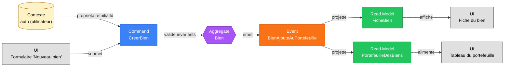

# Slice — Création d'un Bien

> **Mode** : Orchestration Métier (cf. `MISSION.md`). Analyse métier uniquement, pas de code.
>
> **Statut** : *Slice métier **validé**. Prêt pour implémentation.*

## 1. Décisions actées

| #   | Décision                                                                                                                          |
|-----|-----------------------------------------------------------------------------------------------------------------------------------|
| D1  | `CreerBien` est la **seule** porte d'entrée d'un bien dans le portefeuille (pas d'état brouillon, pas de slice « prêt pour bail »).|
| D2  | Données minimales et opérationnelles (cf. §7). Pas de diagnostics, copropriété, encadrement ici.                                  |
| D3  | Une `CHAMBRE_COLOCATION` est rattachée à un bien parent de type `MAISON` ou `APPARTEMENT`.                                        |
| D4  | `TypeBien` structurel = **{`MAISON`, `APPARTEMENT`, `CHAMBRE_COLOCATION`}**. Les libellés `T1`..`T6+` sont **dérivés** par le read model quand `typeBien = APPARTEMENT`. Plus de `STUDIO` : un appartement à `nbPiecesPrincipales = 1` est étiqueté `T1`. |
| D5  | Les **charges sont au forfait pour un logement meublé, en provision sinon**. La modalité est **dérivée** de `meuble` (pas saisie en commande), et historisée dans l'événement pour traçabilité.|
| D6  | Pour une `CHAMBRE_COLOCATION` : invariant strict `Σ surfaces des chambres rattachées ≤ surface du bien parent`. Un bail futur pourra porter sur 1..N chambres (hors scope ici). |
| D7  | Un bien est créé par un **utilisateur applicatif connecté**, qui en devient le **propriétaire initial**. `proprietaireInitialId` est dérivé du contexte d'authentification, pas saisi par l'UI. |
| D8  | Pas de `reference` métier saisie. L'identifiant est le `bienId` (UUID).                                                            |
| D9  | Nommage de l'événement : **`BienAjouteAuPortefeuille`** (langage métier).                                                         |
| D10 | Méthode de mesure de la surface : **surface habitable Boutin** par défaut (un seul champ `surfaceM2`).                            |
| D11 | Devise : **EUR uniquement** en V1. Pas de champ `devise` dans la commande ni l'événement.                                       |
| D12 | Architecture événementielle : **un fait métier = un événement nommé au passé**. Pas d'événement « *Updated* » fourre-tout (cf. §10). |
| D13 | **Modèle d'habilitations multi-utilisateurs** introduit. Un bien a un *propriétaire initial* (créateur), peut avoir des *co-propriétaires* (autres comptes avec droits de propriétaire), et des *administrateurs délégués* (tiers à qui un propriétaire octroie un droit d'administration limité). À la **création**, seul le propriétaire initial existe. Les autres ayants droit s'ajoutent via des slices ultérieurs (cf. §2). |
| D14 | Pour une `CHAMBRE_COLOCATION` : **libellé de chambre obligatoire** (nom ou numéro, ex. « Chambre 1 », « Chambre côté cour »), **unique parmi les chambres du même parent**. Interdit pour les autres types de bien. |
| D15 | **Point d'entrée UX (révisé 2026-09-03, retour utilisateur)** : une `CHAMBRE_COLOCATION` n'est plus un type sélectionnable isolément dans le formulaire « Nouveau bien ». Ce formulaire ne crée plus qu'un `MAISON` ou `APPARTEMENT`, avec une case à cocher « C'est une colocation » qui révèle une saisie groupée des chambres (libellé, surface, loyer, charges, meublé), soumises séquentiellement juste après le bien parent — chaque chambre reste néanmoins une commande `CreerBien` indépendante (D9, un aggregate par bien), sans changement du modèle domaine. Ajouter une chambre à un bien parent **déjà existant** se fait depuis sa fiche d'édition (slice Modification d'un Bien Existant, `docs/slices/modification-bien.md`), pas depuis « Nouveau bien ». En cas d'échec partiel sur une chambre (libellé dupliqué, surface dépassée), le bien parent et les chambres déjà acceptées restent créés ; l'erreur s'affiche sur la ligne en cause pour correction et renvoi. |
| D16 | **V1 — vérification de droit sur le bien parent** : en l'absence du slice « Habilitations sur un Bien », « ayant droit » = propriétaire initial uniquement. Le code vérifie que `proprietaireInitialId` du parent correspond à l'utilisateur connecté. Le slice habilitations élargira cette vérification sans rupture. |

## 2. Dépendances de slices

| Slice dépendant                          | Pourquoi                                                                                                  |
|------------------------------------------|-----------------------------------------------------------------------------------------------------------|
| **Création d'un Utilisateur** (amont)    | `proprietaireInitialId` doit pointer vers un utilisateur applicatif existant.                            |
| **Habilitations sur un Bien** (aval)     | Couvrira `AjouterCoProprietaire`, `OctroyerDelegationAdministration`, `RevoquerDelegation`, `RetirerCoProprietaire`. Hors scope ici, mais le modèle de données de `Bien` doit pouvoir l'accueillir sans rupture. |

## 3. Périmètre

- **Inclus** : ajout au portefeuille d'un local d'habitation destiné à la location (résidence principale, France métropolitaine), par l'utilisateur connecté qui en devient propriétaire initial.
- **Exclus** : modifications post-création, partage/délégation de droits, diagnostics, copropriété, encadrement, photos, annonce, bail, état des lieux, quittancement.

## 4. Acteurs

| Acteur                          | Rôle                                                              |
|---------------------------------|-------------------------------------------------------------------|
| **Utilisateur (propriétaire initial)** | Saisit le bien dans son portefeuille. Acteur unique de ce slice. |

## 5. Ubiquitous language

| Terme                       | Définition métier                                                                                  |
|-----------------------------|----------------------------------------------------------------------------------------------------|
| **Bien**                    | Local immobilier identifié, candidat à la mise en location.                                       |
| **Portefeuille**            | Ensemble des biens sur lesquels un utilisateur a un droit d'administration.                       |
| **Type de bien**            | Nature structurelle : `MAISON`, `APPARTEMENT`, `CHAMBRE_COLOCATION`.                              |
| **Libellé commercial**      | Étiquette dérivée pour affichage : `T1` à `T6+` pour un `APPARTEMENT`, `Maison`, `Chambre en colocation`. |
| **Bien parent**             | Pour une `CHAMBRE_COLOCATION` : la maison ou l'appartement physique qui la contient.              |
| **Libellé de chambre**      | Nom ou numéro distinguant une chambre parmi celles d'un même parent (D14).                        |
| **Pièces principales**      | Au sens INSEE : séjour + chambres (hors cuisine, salle d'eau, WC, entrée, dégagements).           |
| **Loyer hors charges**      | Montant principal dû au bailleur, hors charges récupérables.                                       |
| **Charges**                 | Montant prévisionnel récupérable sur le locataire. Modalité dérivée du caractère meublé (D5).     |
| **Provision sur charges**   | Régularisation annuelle sur justificatifs (logement nu, loi 1989 art. 23).                        |
| **Forfait de charges**      | Montant fixe non régularisable (logement meublé, loi 1989 art. 25-10).                            |
| **Disponibilité**           | Date à partir de laquelle le bien est physiquement louable.                                       |
| **Meublé**                  | Logement comportant le mobilier listé au décret 2015-981 (détail à venir).                         |
| **Propriétaire initial**    | Utilisateur ayant créé le bien dans son portefeuille. Premier propriétaire par construction.       |
| **Co-propriétaire**         | Autre utilisateur applicatif ayant un droit de propriétaire sur le bien (ajouté ultérieurement).  |
| **Administrateur délégué**  | Utilisateur tiers à qui un propriétaire a octroyé un droit d'administration limité (ajouté ultérieurement). |
| **Ayant droit**             | Terme générique englobant propriétaires (initial et co-) et administrateurs délégués.             |

## 6. Diagramme Event Modeling



## 7. Command — `CreerBien`

| Champ                           | Type                | Origine                  | Contraintes                                                                                    |
|---------------------------------|---------------------|--------------------------|------------------------------------------------------------------------------------------------|
| `proprietaireInitialId`         | `UtilisateurId`     | Contexte d'auth          | Non saisi par l'UI. Dérivé du compte connecté.                                                 |
| `typeBien`                      | `TypeBien`          | UI                       | `MAISON` \| `APPARTEMENT` \| `CHAMBRE_COLOCATION`.                                              |
| `bienParentId`                  | `BienId?`           | UI                       | **Obligatoire si** `typeBien = CHAMBRE_COLOCATION`, **interdit sinon**.                         |
| `libelleChambre`                | `String?`           | UI                       | **Obligatoire si** `typeBien = CHAMBRE_COLOCATION`, **interdit sinon**. Non vide, ≤ 50 car., unique parmi les chambres du parent (D14). |
| `nbPiecesPrincipales`           | `Entier`            | UI                       | ≥ 1.                                                                                            |
| `surfaceM2`                     | `Decimal`           | UI                       | > 0, méthode Boutin.                                                                            |
| `meuble`                        | `Boolean`           | UI                       |                                                                                                 |
| `loyerHorsChargesEnCentimes`    | `Money`             | UI                       | ≥ 0, EUR.                                                                                       |
| `chargesEnCentimes`             | `Money`             | UI                       | ≥ 0, EUR.                                                                                       |
| `adresse`                       | `Adresse`           | UI ou héritée            | Numéro, voie, complément, code postal, commune, pays. Héritée du parent si `CHAMBRE_COLOCATION` (D3). |
| `disponibleAPartirDu`           | `LocalDate`         | UI                       | Date métier (peut être passée ou future).                                                       |

> `modaliteCharges` n'est **pas** un champ de la commande : elle est entièrement dérivée de `meuble` (D5).

## 8. Event — `BienAjouteAuPortefeuille`

Émis si et seulement si tous les invariants (§9) sont satisfaits.

| Champ                           | Type                | Remarques                                                                       |
|---------------------------------|---------------------|---------------------------------------------------------------------------------|
| `bienId`                        | `UUID`              | Généré côté domaine.                                                            |
| `proprietaireInitialId`         | `UtilisateurId`     | Reporté de la commande. Sert de premier ayant droit (D13).                      |
| `typeBien`                      | `TypeBien`          |                                                                                 |
| `bienParentId`                  | `BienId?`           | Présent uniquement pour `CHAMBRE_COLOCATION`.                                   |
| `libelleChambre`                | `String?`           | Présent uniquement pour `CHAMBRE_COLOCATION`.                                   |
| `nbPiecesPrincipales`           | `Entier`            |                                                                                 |
| `surfaceM2`                     | `Decimal`           |                                                                                 |
| `meuble`                        | `Boolean`           |                                                                                 |
| `loyerHorsChargesEnCentimes`    | `Money`             |                                                                                 |
| `chargesEnCentimes`             | `Money`             |                                                                                 |
| `modaliteCharges`               | `ModaliteCharges`   | Dérivée à l'émission : `FORFAIT` si `meuble = true`, `PROVISION` sinon (D5). Historisée dans l'événement pour traçabilité. |
| `adresse`                       | `Adresse`           | Résolue (héritée du parent si chambre).                                         |
| `disponibleAPartirDu`           | `LocalDate`         |                                                                                 |
| `ajouteLe`                      | `Instant`           | Horodatage technique.                                                           |

## 9. Invariants

### Champs simples
1. **I-1** `proprietaireInitialId` non nul, désigne un utilisateur applicatif existant et actif.
2. **I-2** `typeBien` renseigné.
3. **I-3** `nbPiecesPrincipales ≥ 1`.
4. **I-4** `surfaceM2 > 0`.
5. **I-5** `loyerHorsChargesEnCentimes ≥ 0`.
6. **I-6** `chargesEnCentimes ≥ 0`.
7. **I-7** `disponibleAPartirDu` non nulle.
8. **I-8** `adresse` normalisée (numéro, voie, code postal, commune renseignés).

### Charges
9. **I-CHARGES-1** *Règle de dérivation (pas une validation de saisie)* : à l'émission de l'événement, `modaliteCharges = FORFAIT` si `meuble = true`, sinon `PROVISION`.

### Spécifique colocation
10. **I-COLOC-1** `bienParentId` requis ⇔ `typeBien = CHAMBRE_COLOCATION`.
11. **I-COLOC-2** Le bien parent existe et l'utilisateur connecté est **ayant droit** du parent (propriétaire initial, co-propriétaire, ou administrateur délégué). Son `typeBien ∈ {MAISON, APPARTEMENT}`.
12. **I-COLOC-3** L'adresse de la chambre est héritée strictement de celle du parent (pas de saisie séparée).
13. **I-COLOC-4** `Σ surfaces des chambres déjà rattachées au parent + surfaceM2 (nouvelle chambre) ≤ surfaceM2 (parent)`. Violation ⇒ refus.
14. **I-COLOC-5** `libelleChambre` requis ⇔ `typeBien = CHAMBRE_COLOCATION`. Non vide, ≤ 50 caractères, **unique parmi les chambres déjà rattachées au même parent** (insensible à la casse et aux espaces de bord).

## 10. Stratégie événementielle (rappel D12)

- **Un fait métier = un événement**, au passé, dans le langage du domaine.
- **Création** → `BienAjouteAuPortefeuille` (ce slice, événement unique).
- **Enrichissements futurs** = événements fins indépendants. Liste indicative (non exhaustive, propre à chaque slice ultérieur) :
  - Sur le bien lui-même : `LoyerRevise`, `ChargesRevisees`, `MeubleEntreDansLeLogement`, `LogementDevenuNu`, `DisponibiliteRevisee`, `LibelleChambreRenomme`, `BienRetireDuPortefeuille`.
  - Sur les habilitations (slice dédié, D13) : `CoProprietaireAjoute`, `CoProprietaireRetire`, `DelegationAdministrationOctroyee`, `DelegationAdministrationRevoquee`.
  - Plus tard, autour du bail : `DiagnosticsBienRenseignes`, `BailSigne`, `EtatDesLieuxRealise`, `LoyerQuittance`, etc.
- **Aggregate `Bien`** = frontière de cohérence. Les habilitations peuvent être un sous-état du `Bien` ou un aggregate dédié `HabilitationsBien` (à trancher dans le slice habilitations).
- **Colocation** : référence faible `bienParentId` (chambres et parent sont des aggregates distincts). Les invariants transverses (I-COLOC-2, I-COLOC-4, I-COLOC-5) sont vérifiés à la création en consultant l'état actuel du parent.

### Read models projetés depuis `BienAjouteAuPortefeuille`

| Read Model              | Usage                                                                                                  |
|-------------------------|--------------------------------------------------------------------------------------------------------|
| `FicheBien`             | Affichage détaillé d'un bien. Calcule `libelleCommercial` (cf. §11). Inclut `libelleChambre` si applicable. |
| `PortefeuilleDesBiens`  | Liste paginée et filtrable des biens dont l'utilisateur est ayant droit. Calcule `libelleCommercial`.  |

## 11. Calcul du libellé commercial (read model)

Fonction pure appliquée par la projection :

```
libelleCommercial(typeBien, nbPiecesPrincipales, libelleChambre) =
    MAISON                → "Maison"
    APPARTEMENT, n = 1    → "T1"
    APPARTEMENT, n = 2    → "T2"
    APPARTEMENT, n = 3    → "T3"
    APPARTEMENT, n = 4    → "T4"
    APPARTEMENT, n = 5    → "T5"
    APPARTEMENT, n ≥ 6    → "T6+"
    CHAMBRE_COLOCATION    → "Chambre en colocation — " + libelleChambre
```

Aucun stockage de ce libellé dans l'événement : il dérive entièrement de `(typeBien, nbPiecesPrincipales, libelleChambre)`.

## 12. Questions résiduelles

Aucune. Toutes les questions ouvertes au cours de l'analyse ont été tranchées et intégrées au tableau des décisions (§1).

## 13. Hors périmètre

- Modifications post-création (loyer, charges, modalité, dispo, meublé, libellé de chambre) → events dédiés (§10).
- **Ajout de co-propriétaires et délégations d'administration → slice « Habilitations sur un Bien ».**
- Photos, descriptif marketing, annonce.
- Diagnostics, copropriété, encadrement des loyers, permis de louer → slice bail.
- Création d'utilisateur → slice dédié (dépendance amont, §2).
- Bail : signature, état des lieux, quittancement, indexation IRL.

---

**Conséquences sur l'existant à signaler avant implémentation** :

- Le code Java déjà committé (`CreerBien` avec `reference` + `prixEnCentimes`) **ne reflète plus** ce slice. Il sera intégralement remplacé lors de l'implémentation (pas d'effort de rétro-compatibilité).
- L'ancien `docs/event-modeling.md` a été supprimé (session précédente, D6 de cette session-là).
