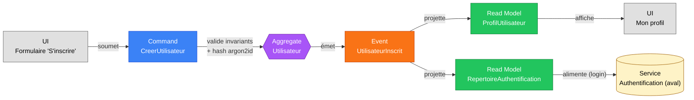

# Slice — Création d'un Utilisateur

> **Mode** : Orchestration Métier (cf. `MISSION.md`). Analyse métier uniquement, pas de code.
>
> **Statut** : *Slice métier **validé**. Prêt pour implémentation.*

## 1. Décisions actées

| #   | Décision                                                                                                                              |
|-----|---------------------------------------------------------------------------------------------------------------------------------------|
| D1  | **Auto-inscription publique** : tout visiteur peut créer son compte. Pas d'inscription sur invitation en V1.                          |
| D2  | **Mot de passe local uniquement** en V1. OAuth / magic link / SSO seront des slices ultérieurs.                                       |
| D3  | À la création, le compte est **`ACTIF` directement** (pas de vérification d'email obligatoire). La vérification d'email sera un slice ultérieur ; à son émission, le statut `EN_ATTENTE_VERIFICATION` pourra être réintroduit. |
| D4  | **Personne physique uniquement** en V1. La personne morale (SCI, SARL, etc.) fera l'objet d'un slice dédié.                           |
| D5  | Les **données civiles complètes** nécessaires à la rédaction d'un bail (date et lieu de naissance, adresse postale, pièce d'identité, etc.) **ne sont pas demandées à l'inscription**. Elles seront recueillies via un slice aval **« Enrichissement du profil »**, et leur complétude conditionnera plus tard la signature d'un bail. |
| D6  | **Politique de mot de passe NIST-style** : longueur minimale **12 caractères**, pas d'exigence de classes de caractères obligatoires (pas de « majuscule + chiffre + spécial »). Recommandation forte de vérifier que le mot de passe ne figure pas dans une base de mots de passe compromis (style HIBP) — à activer dès qu'une intégration externe sera disponible, non bloquant en V1. |
| D7  | **Identifiant de connexion = email**. Pas de pseudonyme/username distinct en V1.                                                      |
| D8  | **Algorithme de hashage : argon2id** avec paramètres OWASP 2024 (mémoire ≥ 64 Mo, itérations ≥ 3, parallélisme ≥ 4, sel ≥ 16 octets). Le champ `hashMotDePasse` encapsule algo + paramètres + sel + hash (PHC string format). |
| D9  | **Consentements (CGU, politique de confidentialité)** intégrés à l'événement `UtilisateurInscrit` avec leurs horodatages. Lors d'une future révision de version des CGU, un nouvel événement `CGUAcceptees(version)` sera émis (slice ultérieur). |
| D10 | **Audit log des connexions** (events `UtilisateurConnecte`, `EchecConnexion`) : **hors V1**. Slice ultérieur dédié au journal d'accès si besoin.                                          |
| D11 | **Aggregate unique `Utilisateur`** en V1 : porte à la fois identité (nom, prénom, email, téléphone) et credentials (hash). Pas de séparation identité/credentials tant qu'on ne supporte qu'une seule méthode d'authentification. |
| D12 | **Email normalisé** (`lowercase` + `trim`) pour l'unicité et le stockage. L'utilisateur peut saisir indifféremment `Foo@Bar.com` ou `foo@bar.com`.                                       |

## 2. Dépendances de slices

| Slice                                       | Position    | Pourquoi                                                                              |
|---------------------------------------------|-------------|---------------------------------------------------------------------------------------|
| **Création d'un Utilisateur** (ce slice)    | —           | Pré-requis pour « Création d'un Bien ».                                              |
| **Authentification** (aval)                 | À modéliser | Permet à un utilisateur créé de se connecter (login + session).                       |
| **Récupération de mot de passe** (aval)     | À modéliser | Flow oublié → email → réinitialisation.                                              |
| **Vérification d'email** (aval)             | À modéliser | Reconsidérée plus tard pour sécuriser l'identité et l'adresse de contact.            |
| **Enrichissement du profil** (aval, D5)     | À modéliser | Données civiles complètes (date/lieu de naissance, adresse postale, pièce d'identité), pré-requis à la signature d'un bail. |
| **Habilitations sur un Bien** (aval)        | À modéliser | Co-propriétaires et administrateurs délégués (cf. slice création de bien).            |
| **Suppression de compte / RGPD** (aval)     | À modéliser | Droit à l'effacement, anonymisation.                                                  |
| **Personne morale** (aval, D4)              | À modéliser | SCI, SARL, etc. — comptes pour entités juridiques.                                    |

## 3. Périmètre

- **Inclus** : auto-inscription d'une personne physique dans l'application avec ses données minimales (email, mot de passe, nom, prénom) et ses consentements. Compte actif immédiatement, prêt à se connecter et à créer des biens.
- **Exclus** : authentification (login), gestion de session, vérification d'email, mots de passe oubliés, mise à jour de profil, données civiles avancées (slice d'enrichissement), personne morale, rôles et permissions transverses, journal d'accès, suppression de compte.

## 4. Acteurs

| Acteur            | Rôle                                                                              |
|-------------------|-----------------------------------------------------------------------------------|
| **Visiteur**      | Personne non encore inscrite qui soumet le formulaire d'inscription. Acteur unique.|

## 5. Ubiquitous language

| Terme                       | Définition métier                                                                                  |
|-----------------------------|----------------------------------------------------------------------------------------------------|
| **Utilisateur**             | Personne physique disposant d'un compte dans l'application. Identifié par un `UtilisateurId` (UUID). |
| **Compte**                  | Synonyme d'utilisateur dans ce slice (identité et credentials fusionnés en V1, D11).             |
| **Email**                   | Adresse électronique unique, sert d'identifiant de connexion et de canal de contact. Normalisé (D12). |
| **Mot de passe**            | Secret choisi par l'utilisateur. **Stocké uniquement sous forme de hash argon2id (D8).**           |
| **Hash de mot de passe**    | Empreinte cryptographique non réversible. Format PHC string (encode algo + paramètres + sel + hash). |
| **CGU**                     | Conditions Générales d'Utilisation, à accepter explicitement à l'inscription (D9).                |
| **Politique de confidentialité** | Information RGPD sur le traitement des données personnelles, à accepter explicitement (D9). |
| **Statut du compte**        | État de cycle de vie. En V1 : `ACTIF` à la création (D3). Valeurs futures possibles : `SUSPENDU`, `SUPPRIME`, et éventuellement `EN_ATTENTE_VERIFICATION` quand le slice « Vérification d'email » sera introduit. |
| **Profil enrichi**          | État futur où les données civiles complètes nécessaires au bail ont été renseignées (slice aval, D5). Non requis pour créer un bien, requis pour signer un bail. |

## 6. Diagramme Event Modeling

## 7. Command — `CreerUtilisateur`

| Champ                       | Type                | Origine          | Contraintes                                                                                  |
|-----------------------------|---------------------|------------------|----------------------------------------------------------------------------------------------|
| `email`                     | `Email`             | UI               | Format RFC 5321. Normalisé (lowercase + trim) avant validation et stockage (D12). **Unique** dans le système (I-2).                                       |
| `motDePasseClair`           | `String`            | UI               | Politique D6 / I-4. **Jamais persisté ni loggué.** Consommé par l'aggregate pour produire un hash (D8), puis détruit.            |
| `nom`                       | `String`            | UI               | Non vide, 1–80 caractères, espaces de bord trimés.                                           |
| `prenom`                    | `String`            | UI               | Non vide, 1–80 caractères, espaces de bord trimés.                                           |
| `telephone`                 | `String?`           | UI               | Optionnel. Si fourni : format E.164 (ex. `+33612345678`).                                    |
| `accepteCGU`                | `Boolean`           | UI               | Doit valoir `true` (I-5). Horodaté dans l'event.                                             |
| `accepteConfidentialite`    | `Boolean`           | UI               | Doit valoir `true` (I-5). Horodaté dans l'event.                                             |

## 8. Event — `UtilisateurInscrit`

| Champ                       | Type             | Remarques                                                                            |
|-----------------------------|------------------|--------------------------------------------------------------------------------------|
| `utilisateurId`             | `UUID`           | Généré côté domaine.                                                                 |
| `email`                     | `Email`          | Normalisé (D12).                                                                     |
| `hashMotDePasse`            | `HashMotDePasse` | PHC string argon2id (D8), encapsule algo + paramètres + sel + hash.                  |
| `nom`                       | `String`         |                                                                                      |
| `prenom`                    | `String`         |                                                                                      |
| `telephone`                 | `String?`        | Format E.164 si présent.                                                             |
| `statut`                    | `StatutCompte`   | `ACTIF` (D3).                                                                        |
| `versionCGU`                | `String`         | Identifiant de la version de CGU acceptée (ex. `cgu-2026-01-01`).                    |
| `cguAccepteesLe`            | `Instant`        | Horodatage de l'acceptation (traçabilité juridique).                                 |
| `versionConfidentialite`    | `String`         | Identifiant de la version de la politique acceptée.                                  |
| `confidentialiteAccepteeLe` | `Instant`        |                                                                                      |
| `inscritLe`                 | `Instant`        | Horodatage technique de l'inscription.                                               |

## 9. Invariants

### Email
1. **I-1** `email` syntaxiquement valide (RFC 5321 — longueur ≤ 254, partie locale ≤ 64, `@` présent, domaine avec au moins un point).
2. **I-2** `email` **unique** dans le système, **après normalisation** (lowercase + trim). Violation ⇒ refus avec message générique « cette adresse ne peut pas être utilisée » (anti-énumération, cf. §11).

### Identité
3. **I-3** `nom` et `prenom` non vides après trim, ≤ 80 caractères, autorisés : lettres Unicode (catégories L*), espaces, apostrophes, tirets, points.

### Mot de passe (D6)
4. **I-4** Longueur ≥ 12 caractères Unicode. Pas d'exigence de classes obligatoires. Comparaison contre une liste de mots de passe compromis (style HIBP) **recommandée mais non bloquante en V1** ; à activer dès qu'une intégration sera disponible.

### Consentements (D9)
5. **I-5** `accepteCGU = true` **et** `accepteConfidentialite = true`. Refus en cas contraire. Les versions actives des CGU et de la politique de confidentialité sont résolues côté domaine au moment de l'émission de l'événement.

### Téléphone
6. **I-6** Si `telephone` fourni : format E.164 valide.

## 10. Stratégie événementielle

- Un fait métier = un événement. Création → `UtilisateurInscrit` (un seul event, contient identité + credentials + consentements).
- **Aggregate `Utilisateur` unique** (D11) : invariants locaux (unicité email, cohérence consentement / activation).
- **Évolutions ultérieures** : si on introduit OAuth / magic link / SSO, on créera un aggregate `MoyenAuthentification` distinct relié à `Utilisateur`. L'event store évolue par ajout, pas par rejeu.

### Events fins anticipés (slices ultérieurs)

- Profil : `ProfilUtilisateurMisAJour`, `TelephoneRevise`, `EmailChangeDemande` (→ verif) → `EmailChange`.
- Sécurité : `MotDePasseRevise`, `MotDePasseReinitialisationDemandee`, `MotDePasseReinitialise`.
- Cycle de vie : `EmailVerifie` (lorsque le slice « Vérification d'email » sera introduit), `CompteSuspendu`, `CompteReactive`, `CompteSupprime` (RGPD).
- Consentements : `CGUAcceptees(version)`, `ConfidentialiteAcceptee(version)` lors de révisions de versions (D9).
- Connexion : `UtilisateurConnecte`, `EchecConnexion` (slice « Journal d'accès » futur, D10).
- Enrichissement profil (D5) : `DonneesCivilesRenseignees`, `AdresseDomicileRenseignee`, `PieceIdentiteRenseignee`, etc.

### Read models projetés depuis `UtilisateurInscrit`

| Read Model                       | Usage                                                                                       |
|----------------------------------|---------------------------------------------------------------------------------------------|
| `ProfilUtilisateur`              | Fiche profil affichée à l'utilisateur. **N'expose jamais** `hashMotDePasse`.                |
| `RepertoireAuthentification`     | Index `email → (utilisateurId, hashMotDePasse, statut)`. Consommé exclusivement par le service d'authentification (slice aval). **Jamais exposé à l'UI** ni à une API publique. |

## 11. Sécurité — points non négociables

- Le `motDePasseClair` **ne sort jamais** de l'aggregate : pas de log, pas de trace de pile, pas de message d'exception qui le contient. Type dédié recommandé (wrapper qui interdit `toString` / sérialisation).
- Le `hashMotDePasse` n'est **jamais** projeté dans un read model destiné à l'UI ni renvoyé par une API publique. Seul le `RepertoireAuthentification` interne le contient.
- Messages d'erreur d'inscription **génériques** sur duplication d'email (« cette adresse ne peut pas être utilisée ») pour éviter l'énumération des comptes existants.
- Choix d'argon2id avec paramètres adaptatifs (D8) : une éventuelle fuite d'event store rend impraticable la récupération massive des mots de passe.
- Conformité RGPD : horodatage et version des consentements dans l'event (traçabilité), base légale = consentement + exécution du contrat. Anonymisation prévue dans un slice ultérieur.
- Rate limiting et anti-spam sur le endpoint d'inscription : nécessaires côté adapter web (CAPTCHA ou équivalent recommandé). À traiter à l'implémentation, hors modélisation métier.

## 12. Questions résiduelles

Aucune. Toutes les questions ouvertes au cours de l'analyse ont été tranchées et intégrées au tableau des décisions (§1).

## 13. Hors périmètre

- Authentification (login, session, JWT/cookie) → slice dédié.
- Vérification d'email (envoi du lien + clic) → slice dédié (D3).
- Récupération de mot de passe → slice dédié.
- Mise à jour de profil et changement d'email → slice dédié.
- Enrichissement du profil pour bail (données civiles complètes) → slice dédié (D5).
- Personne morale → slice dédié (D4).
- Habilitations sur un bien (co-propriété, délégation) → slice dédié.
- Journal d'accès (events de connexion) → slice dédié (D10).
- Suppression de compte / RGPD → slice dédié.
- Multi-tenant, organisations, rôles d'administration applicative → hors V1.

---

**Conséquence sur l'existant** : aucune. Aucun code utilisateur n'a encore été produit.
