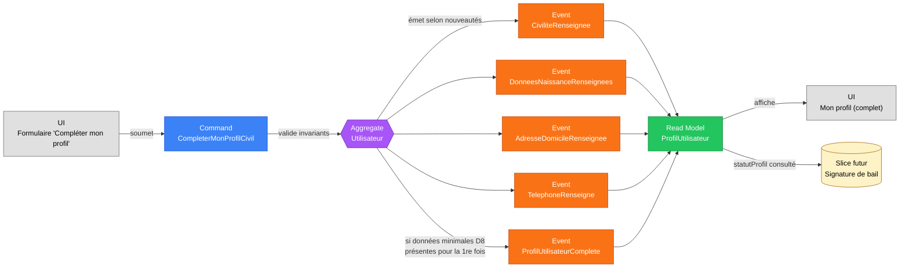

# Slice — Enrichissement du Profil (pour bail)

> **Mode** : Orchestration Métier (cf. `MISSION.md`). Analyse métier uniquement, pas de code.
>
> **Statut** : *Slice métier **validé**. Prêt pour implémentation.*

## 1. Décisions actées

| #   | Décision                                                                                                                                       |
|-----|------------------------------------------------------------------------------------------------------------------------------------------------|
| D1  | **Commande composite** `CompleterMonProfilCivil` (une intention « je remplis mon dossier »), qui émet plusieurs **événements fins** au passé. Les modifications ultérieures seront couvertes par un slice distinct avec des commandes fines. |
| D2  | **Pas de pièce d'identité dans ce slice** (ni métadonnées, ni scan). La pièce d'identité du bailleur n'étant pas une mention obligatoire au bail loi 1989, on évite la dette RGPD. Reporté à un futur bounded context « Documents ». |
| D3  | **Téléphone optionnel** dans ce slice (comme à l'inscription). Sa présence n'est pas requise pour basculer en statut `COMPLET`.                |
| D4  | **Nationalité optionnelle** : non obligatoire au bail loi 1989.                                                                               |
| D5  | **Civilité conservée** avec les valeurs `MADAME` \| `MONSIEUR` \| `NON_RENSEIGNEE`. Optionnelle. Élargissement éventuel des valeurs en version ultérieure. |
| D6  | **Modifications ultérieures hors de ce slice**. Un slice « Modification du profil » dédié couvrira les *changements* (déménagement, nouveau téléphone, etc.) avec ses propres commandes et événements (`AdresseDomicileChangee`, `TelephoneChange`, etc.). |
| D7  | **Adresse en saisie libre** en V1 (pas de résolution BAN obligatoire). La normalisation via la Base Adresse Nationale pourra être ajoutée plus tard côté adapter web sans rupture du modèle. |
| D8  | **Données minimales pour `COMPLET`** : date de naissance + lieu de naissance (ville + pays) + adresse de domicile complète. Civilité, nationalité et téléphone sont des compléments facultatifs, saisissables mais non bloquants. |
| D9  | **Aggregate `Utilisateur` étendu** (pas d'aggregate `Profil` séparé). Les événements de ce slice s'ajoutent à ceux du slice utilisateur.       |
| D10 | **Bascule de statut = événement à part entière** : `ProfilUtilisateurComplete` est émis une seule fois lors du premier passage `MINIMAL → COMPLET`. C'est ce signal qui débloquera la signature de bail (slice futur).                 |

## 2. Contexte et finalité métier

Le slice « Création d'un Utilisateur » (cf. `docs/slices/creation-utilisateur.md`, D5) a délibérément limité les données collectées à l'inscription : email, mot de passe, nom, prénom, téléphone optionnel, consentements. Ces données suffisent pour se connecter et créer un bien, mais **pas pour signer un bail** au sens de la loi du 6 juillet 1989 et du décret 2015-587 (contrat type), qui exige une identification précise du bailleur.

Ce slice modélise donc la **complétion progressive des données civiles** d'un utilisateur, jusqu'à ce qu'il bascule en état *« profil complet »* — pré-requis à la signature d'un bail.

Trois usages métier visés :

1. **Signature de bail** : alimentation des mentions « le bailleur » du contrat.
2. **Comptes rendus de gestion** et courriers : adresse postale, civilité.
3. **Quittancement / reversement** (slice futur) : coordonnées de contact.

## 3. Dépendances de slices

| Slice                                       | Position    | Pourquoi                                                                              |
|---------------------------------------------|-------------|---------------------------------------------------------------------------------------|
| **Création d'un Utilisateur** (amont)       | Validé      | Le profil enrichi *prolonge* l'aggregate `Utilisateur`. Sans utilisateur, rien à enrichir. |
| **Enrichissement du Profil** (ce slice)     | —           | —                                                                                     |
| **Modification du profil** (aval, D6)       | À modéliser | Couvre les *changements* (déménagement, nouveau téléphone, etc.).                     |
| **Signature d'un Bail** (aval)              | À modéliser | Consommateur principal : exigera `ProfilUtilisateur.statutProfil = COMPLET` avant d'autoriser la signature, puis snapshotera les champs dans le bail. |
| **Documents** (aval, D2)                    | À modéliser | Bounded context futur si la pièce d'identité ou d'autres documents sont à stocker.    |

## 4. Périmètre

- **Inclus** : *première saisie* par l'utilisateur de ses données civiles, jusqu'à atteindre le statut `COMPLET`.
- **Exclus** : modifications ultérieures (D6), pièce d'identité (D2), profession, situation matrimoniale, régime matrimonial, RIB/IBAN, droit à la rectification structurée RGPD (slice dédié), validation par un tiers (KYC), personne morale.

## 5. Acteurs

| Acteur                          | Rôle                                                                              |
|---------------------------------|-----------------------------------------------------------------------------------|
| **Utilisateur (propriétaire)**  | Complète ses propres données civiles depuis « Mon profil ». Acteur unique.        |

> Hypothèse : un utilisateur ne complète **que son propre** profil. Aucun autre utilisateur (administrateur délégué, co-propriétaire) n'a le droit d'éditer le profil d'autrui.

## 6. Ubiquitous language

| Terme                          | Définition métier                                                                                  |
|--------------------------------|----------------------------------------------------------------------------------------------------|
| **Profil**                     | Ensemble des données associées à un `Utilisateur`. À l'inscription : `MINIMAL`. Après ce slice : `COMPLET`. |
| **Statut du profil**           | `MINIMAL` (sortie du slice utilisateur) ou `COMPLET` (sortie de ce slice). Projeté depuis les événements. |
| **Données civiles**            | Identité légale : civilité (D5), date de naissance, lieu de naissance (ville + pays), nationalité (D4). |
| **Adresse de domicile**        | Adresse postale du domicile principal de l'utilisateur, distincte de l'adresse des biens loués.   |
| **Coordonnées**                | Email (déjà capturé à l'inscription) + téléphone (optionnel, D3).                                 |
| **Civilité**                   | `MADAME` \| `MONSIEUR` \| `NON_RENSEIGNEE` (D5).                                                  |

## 7. Diagramme Event Modeling

## 8. Command — `CompleterMonProfilCivil`

| Champ                       | Type                | Origine          | Contraintes                                                                                  |
|-----------------------------|---------------------|------------------|----------------------------------------------------------------------------------------------|
| `utilisateurId`             | `UtilisateurId`     | Contexte d'auth  | Non saisi. Doit correspondre à l'utilisateur connecté (I-1).                                 |
| `civilite`                  | `Civilite?`         | UI               | `MADAME` \| `MONSIEUR` \| `NON_RENSEIGNEE`. Optionnel (D5). Défaut : non émis.                |
| `dateNaissance`             | `LocalDate?`        | UI               | Optionnel à la *soumission* (l'utilisateur peut affiner en plusieurs passes) ; **obligatoire pour basculer en `COMPLET`** (D8). Si fournie : I-2, I-3. |
| `lieuNaissanceVille`        | `String?`           | UI               | Idem dateNaissance. Si fourni : I-4.                                                          |
| `lieuNaissancePaysIso`      | `String?`           | UI               | Idem. Si fourni : I-5.                                                                       |
| `nationaliteIso`            | `String?`           | UI               | Optionnel (D4). Si fourni : I-6.                                                              |
| `adresseDomicile`           | `Adresse?`          | UI               | Optionnelle à la *soumission* ; **obligatoire pour basculer en `COMPLET`** (D8). Si fournie : I-7, I-8. |
| `telephone`                 | `String?`           | UI               | Optionnel (D3). Si fourni : I-9 (format E.164). N'influence pas la bascule.                  |

### Idempotence et émission conditionnelle

À chaque soumission de la commande :

- Seuls les événements correspondant à un **renseignement nouveau** sont émis (premier passage du champ d'absent à présent).
- Si la donnée était déjà renseignée et qu'on la re-soumet à l'identique : **aucun événement**.
- Si la donnée était déjà renseignée et que l'utilisateur en envoie une valeur *différente* : **refus** côté commande (ce n'est pas un *renseignement* mais une *modification*, qui relève du slice « Modification du profil », D6). Message d'erreur explicite.
- Lorsque le triplet minimal D8 (date de naissance + lieu de naissance + adresse de domicile) est complet **pour la première fois**, l'événement `ProfilUtilisateurComplete` est émis dans le même flux.

## 9. Events émis

Un fait métier = un événement (D12 du slice création de bien, repris ici). Tous portent `utilisateurId` et `renseigneLe : Instant`.

| Événement                          | Émis quand…                                                                                  | Charge utile principale                                                                  |
|------------------------------------|----------------------------------------------------------------------------------------------|------------------------------------------------------------------------------------------|
| `CiviliteRenseignee`               | La civilité passe d'absente à une valeur explicite (1re fois).                              | `civilite`.                                                                              |
| `DonneesNaissanceRenseignees`      | La date + le lieu de naissance sont renseignés pour la 1re fois (groupés, car indissociables au bail). | `dateNaissance`, `lieuNaissanceVille`, `lieuNaissancePaysIso`, `nationaliteIso?`.       |
| `AdresseDomicileRenseignee`        | L'adresse de domicile est renseignée pour la 1re fois.                                       | `adresseDomicile` (numéro, voie, complément?, codePostal, commune, paysIso).            |
| `TelephoneRenseigne`               | Le téléphone est renseigné pour la 1re fois (s'il n'avait pas été saisi à l'inscription).   | `telephone` (E.164).                                                                     |
| `ProfilUtilisateurComplete`        | Bascule du statut `MINIMAL` → `COMPLET` : conditions D8 atteintes pour la 1re fois (D10).   | `completeLe : Instant`.                                                                  |

> Pas d'événement « *ProfilEnrichi* » fourre-tout (cohérence avec la doctrine « un fait = un event »).

## 10. Read Model — `ProfilUtilisateur` (extension)

Le read model `ProfilUtilisateur` (initialement projeté depuis `UtilisateurInscrit`) est enrichi par les événements de ce slice :

| Bloc                       | Contenu                                                                                  |
|----------------------------|------------------------------------------------------------------------------------------|
| `identite`                 | `nom`, `prenom`, `civilite?`, `dateNaissance?`, `lieuNaissanceVille?`, `lieuNaissancePaysIso?`, `nationaliteIso?`. |
| `coordonnees`              | `email`, `telephone?`.                                                                   |
| `adresseDomicile`          | `numero?`, `voie?`, `complement?`, `codePostal?`, `commune?`, `paysIso?`.                |
| `statutProfil`             | `MINIMAL` \| `COMPLET`. Calculé par la projection à partir des événements (présence de `ProfilUtilisateurComplete` ou pas). |
| `champsManquantsPourBail`  | Liste des champs encore manquants pour atteindre `COMPLET` (D8). Vide si `COMPLET`. Utile pour l'UI. |

Le slice « Signature de bail » consultera **uniquement** `statutProfil = COMPLET` pour autoriser ses propres commandes ; les autres champs seront *snapshotés* dans le bail au moment de la signature (figés à cet instant pour préserver l'intégrité contractuelle).

## 11. Invariants

### Identité du soumetteur
1. **I-1** `utilisateurId` (de la commande) = identifiant de l'utilisateur connecté. Refus sinon (anti-tentative d'édition d'un profil tiers).

### Date de naissance (si fournie)
2. **I-2** `dateNaissance ≤ today − 18 ans` (majorité civile, condition nécessaire pour signer un bail en France).
3. **I-3** `dateNaissance ≥ 1900-01-01` (plausibilité).

### Lieu de naissance (si fourni)
4. **I-4** `lieuNaissanceVille` non vide après trim, ≤ 80 caractères.
5. **I-5** `lieuNaissancePaysIso` ∈ référentiel ISO 3166-1 alpha-2.

### Nationalité (si fournie, D4)
6. **I-6** `nationaliteIso` ∈ référentiel ISO 3166-1 alpha-2.

### Adresse de domicile (si fournie)
7. **I-7** Champs obligatoires de `Adresse` renseignés ensemble : `numero` (chiffres + éventuellement `bis`, `ter`), `voie`, `codePostal` (format selon le pays), `commune`, `paysIso`. Le `complement` est optionnel.
8. **I-8** `paysIso` ∈ ISO 3166-1 alpha-2.

### Téléphone (si fourni, D3)
9. **I-9** Format E.164 valide.

### Cohérence d'édition
10. **I-10** Si un champ est déjà renseigné sur l'aggregate, sa re-soumission à une valeur différente est **refusée** (relève du slice « Modification du profil », D6). Re-soumission à l'identique : ignorée silencieusement, aucun événement.

### Bascule de statut
11. **I-11** `ProfilUtilisateurComplete` est émis **une seule fois** dans le cycle de vie d'un utilisateur (D10). Conditions : présence simultanée des données D8 (date de naissance, lieu de naissance, adresse de domicile complète) pour la **première fois**.

## 12. Stratégie événementielle

- Aggregate `Utilisateur` étendu (D9) : pas d'aggregate `Profil` séparé tant que les invariants restent locaux.
- **Bascule de statut comme événement** (D10) : permet aux read models et slices consommateurs (signature de bail, notifications) de **réagir** à la bascule plutôt que de la recalculer en permanence.
- **Commande composite à la première saisie** (D1) : reflète l'intention métier globale « je remplis mon dossier » et autorise la complétion en plusieurs passes (l'utilisateur peut soumettre partiellement, revenir, finir plus tard).
- **Commandes fines pour les modifications** (D6, slice ultérieur) : `ChangerMonAdresseDomicile`, `ChangerMonTelephone`, etc. → événements `…Changee`.
- **Tolérance à la complétion progressive** : la commande accepte des valeurs absentes. Tant que les minima D8 ne sont pas tous présents, la bascule n'a pas lieu, mais les événements fins sont émis au fur et à mesure.

## 13. Questions résiduelles

Aucune. Toutes les questions ouvertes au cours de l'analyse ont été tranchées et intégrées au tableau des décisions (§1).

## 14. Hors périmètre

- Modifications ultérieures du profil (D6).
- Pièce d'identité, scan ou métadonnées (D2).
- Profession, situation matrimoniale, régime matrimonial, RIB/IBAN.
- Personne morale (slice dédié, D4 du slice utilisateur).
- Validation par un tiers (KYC).
- Droit à la rectification structurée RGPD (slice suppression / RGPD).
- Multi-profil par utilisateur (un utilisateur = un profil, pas de profil locataire/bailleur distinct dans cette V1).

---

**Conséquence sur l'existant** : aucune (rien n'est encore implémenté côté utilisateur). Le slice étendra l'aggregate `Utilisateur` lors de l'implémentation.
