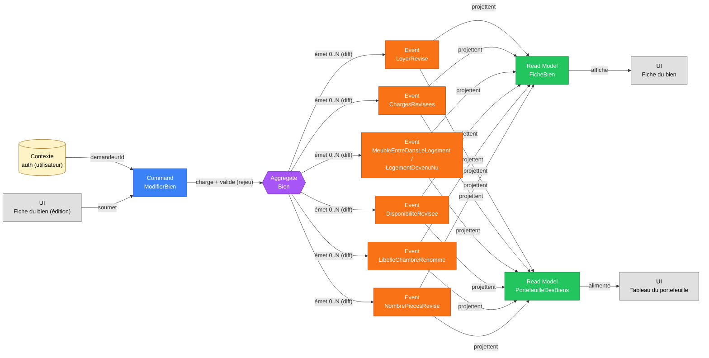

# Slice — Modification d'un Bien Existant

> **Mode** : Orchestration Métier (cf. `MISSION.md`). Analyse métier uniquement, pas de code.
>
> **Statut** : *Slice métier **validé**. Prêt pour implémentation.*

## 1. Décisions actées

| #   | Décision                                                                                                                          |
|-----|-------------------------------------------------------------------------------------------------------------------------------------|
| D1  | **Commande composite** `ModifierBien` (une intention « je corrige la fiche de mon bien »), qui émet **0..N événements fins** au passé — un par champ effectivement modifié. Même style que `CompleterMonProfilCivil` (`docs/slices/enrichissement-profil.md` D1) et que la modification de simulation de rentabilité déjà implémentée. Pas d'événement `BienModifie` fourre-tout (D12 de `creation-bien.md`, réaffirmé ici). |
| D2  | **Champs modifiables en V1** (cf. §7) : loyer hors charges, charges, caractère meublé (avec dérivation de la modalité de charges), date de disponibilité, libellé de chambre, **et nombre de pièces principales** (aucune cascade d'invariant identifiée — n'affecte que le libellé commercial, dérivé). |
| D3  | **Champs volontairement exclus de ce tour** : `surfaceM2` (risque de cascade sur I-COLOC-4, à traiter dans un slice dédié avec ses propres invariants), `adresse` (impliquerait de repropager l'adresse aux chambres rattachées, I-COLOC-3 — rare en pratique, slice dédié si besoin), `typeBien` (changement de nature structurelle — implications sur libellé commercial, invariants de colocation, modalité de charges ; aucun cas d'usage réel identifié), `bienParentId`, `proprietaireInitialId` (relève du slice Habilitations). |
| D4  | **No-op silencieux** : si aucun champ transmis ne diffère de l'état courant du bien, `ModifierBien` n'émet **aucun** événement et renvoie l'état inchangé. Pas d'erreur, pas de bruit dans le flux d'événements. |
| D5  | **Autorisation V1 = propriétaire initial uniquement**, identique à la création (D16 de `creation-bien.md`) : en l'absence du slice « Habilitations sur un Bien », seul `proprietaireInitialId` peut modifier. Réutilise `DroitInsuffisantSurBienException` (déjà mutualisée dans `shared` à l'occasion du slice Projection de Rentabilité). |
| D6  | **Aucun impact rétroactif sur les simulations de rentabilité existantes.** Une simulation snapshote ses propres `revenusLocatifsSimules` à sa création/modification (cf. `docs/slices/projection-rentabilite.md`) et ne relit jamais l'état courant du bien après coup. Modifier un bien ne modifie donc **aucune** simulation passée ; seules les **nouvelles** simulations (ou un préremplissage de formulaire) verront les valeurs à jour. |
| D7  | **Retrait du portefeuille hors scope.** `BienRetireDuPortefeuille` (déjà anticipé dans `creation-bien.md` §10) est un fait de nature différente (désactivation, pas une correction de champ) : slice distinct, non couvert ici. |
| D8  | **Pas de nouveau read model.** Les événements de ce slice projettent vers les read models existants `FicheBien` et `PortefeuilleDesBiens` (mise à jour en place), sans en créer de nouveaux. |
| D9  | **Pas d'historique consultable des révisions** dans ce tour (contrairement aux simulations de rentabilité) : rien dans la demande ne l'exige. L'event store conserve tout techniquement (rejouable) ; ajoutable plus tard sans rupture si le besoin apparaît. |

## 2. Dépendances de slices

| Slice                                       | Position    | Pourquoi                                                                              |
|----------------------------------------------|-------------|----------------------------------------------------------------------------------------|
| **Création d'un Bien** (amont, validé+implémenté) | Requis      | Ce slice modifie un aggregate `Bien` déjà créé. `creation-bien.md` §10 anticipait déjà les noms d'événements repris ici. |
| **Habilitations sur un Bien** (aval, à modéliser) | Élargira D5 | Permettra à un co-propriétaire ou un administrateur délégué de modifier, sans rupture du modèle (même logique que D16 de `creation-bien.md`). |
| **Projection de Rentabilité** (existant, implémenté) | Non-impact (D6) | Confirme qu'aucune cascade n'est nécessaire vers les simulations déjà calculées. |

## 3. Périmètre

- **Inclus** : correction, par le propriétaire initial d'un bien déjà présent dans son portefeuille, des champs opérationnels susceptibles de changer dans le temps (loyer, charges, meublé/nu, disponibilité, libellé de chambre).
- **Exclus** : changement de nature structurelle du bien (type, surface, pièces, adresse, rattachement à un parent), transfert de propriété, retrait du portefeuille, habilitations multi-utilisateurs (voir §12 pour le détail des arbitrages).

## 4. Acteurs

| Acteur                                  | Rôle                                                                 |
|-------------------------------------------|-----------------------------------------------------------------------|
| **Utilisateur (propriétaire initial)**    | Corrige les champs de son propre bien depuis sa fiche. Acteur unique (D5). |

## 5. Ubiquitous language

| Terme                        | Définition métier                                                                                   |
|------------------------------|--------------------------------------------------------------------------------------------------------|
| **Révision**                 | Correction d'un champ opérationnel d'un bien déjà créé (par opposition à sa création initiale).       |
| **Meublement**               | Bascule de l'état meublé/nu d'un logement, avec conséquence dérivée sur la modalité de charges (I-CHARGES-1). |
| **Disponibilité**            | Cf. `creation-bien.md` — ici, sa **révision** (ex. relocation plus tôt/tard que prévu).                |
| *(autres termes)*            | Cf. glossaire de `creation-bien.md` §5, inchangé.                                                     |

## 6. Diagramme Event Modeling

## 7. Command — `ModifierBien`

| Champ                           | Type                | Origine                  | Contraintes                                                                                    |
|---------------------------------|---------------------|--------------------------|--------------------------------------------------------------------------------------------------|
| `bienId`                        | `BienId`            | UI (route)               | Doit référencer un bien existant.                                                               |
| `demandeurId`                   | `UtilisateurId`     | Contexte d'auth          | Non saisi par l'UI. Doit être `proprietaireInitialId` du bien (D5).                              |
| `loyerHorsChargesEnCentimes`    | `Money`             | UI                       | ≥ 0, EUR (identique à I-5 création).                                                             |
| `chargesEnCentimes`             | `Money`             | UI                       | ≥ 0, EUR (identique à I-6 création).                                                             |
| `meuble`                        | `Boolean`           | UI                       |                                                                                                    |
| `disponibleAPartirDu`           | `LocalDate`         | UI                       | Non nulle (identique à I-7 création).                                                            |
| `libelleChambre`                | `String?`           | UI                       | **Obligatoire si** `typeBien = CHAMBRE_COLOCATION`, **interdit sinon**. Non vide, ≤ 50 car., unique parmi les *autres* chambres du même parent. |
| `nbPiecesPrincipales`           | `Entier`            | UI                       | ≥ 1 (identique à I-3 création).                                                                   |

> La commande transmet **l'état cible complet** des champs modifiables (comme un formulaire d'édition classique) ; c'est le service applicatif qui **diffe** contre l'état courant du bien (rechargé par rejeu, cf. §10) pour décider quels événements fins émettre (D1, D4).

## 8. Events

Chaque événement est émis **si et seulement si** le champ correspondant diffère effectivement de l'état courant (D4), et que les invariants (§9) sont satisfaits pour l'ensemble de la commande.

### `LoyerRevise`

| Champ                        | Type      | Remarques |
|-------------------------------|-----------|-----------|
| `bienId`                      | `UUID`    |           |
| `loyerHorsChargesEnCentimes`  | `Money`   | Nouvelle valeur. |
| `survenuLe`                   | `Instant` | Horodatage technique. |

### `ChargesRevisees`

| Champ                  | Type      | Remarques |
|-------------------------|-----------|-----------|
| `bienId`                | `UUID`    |           |
| `chargesEnCentimes`     | `Money`   | Nouvelle valeur. |
| `survenuLe`              | `Instant` | Horodatage technique. |

### `MeubleEntreDansLeLogement` / `LogementDevenuNu`

Deux événements distincts pour les deux sens de la bascule (D12 de `creation-bien.md` : un fait métier nommé, pas un booléen générique).

| Champ                | Type                | Remarques |
|-----------------------|---------------------|-----------|
| `bienId`              | `UUID`              |           |
| `modaliteCharges`     | `ModaliteCharges`   | Dérivée (I-MOD-7) : `FORFAIT` pour `MeubleEntreDansLeLogement`, `PROVISION` pour `LogementDevenuNu`. Historisée pour traçabilité, comme à la création. |
| `survenuLe`            | `Instant`           | Horodatage technique. |

### `DisponibiliteRevisee`

| Champ                    | Type        | Remarques |
|---------------------------|-------------|-----------|
| `bienId`                  | `UUID`      |           |
| `disponibleAPartirDu`     | `LocalDate` | Nouvelle valeur. |
| `survenuLe`                | `Instant`   | Horodatage technique. |

### `LibelleChambreRenomme`

| Champ              | Type      | Remarques |
|----------------------|-----------|-----------|
| `bienId`             | `UUID`    | Doit être une `CHAMBRE_COLOCATION`. |
| `libelleChambre`     | `String`  | Nouvelle valeur, déjà validée unique (I-MOD-6). |
| `survenuLe`           | `Instant` | Horodatage technique. |

### `NombrePiecesRevise`

| Champ                  | Type      | Remarques |
|--------------------------|-----------|-----------|
| `bienId`                 | `UUID`    |           |
| `nbPiecesPrincipales`    | `Entier`  | Nouvelle valeur ≥ 1 (I-MOD-9). Impacte `libelleCommercial` dérivé (ex. T3 → T4) sans invariant de cascade. |
| `survenuLe`               | `Instant` | Horodatage technique. |

## 9. Invariants

1. **I-MOD-1** `bienId` doit référencer un bien existant, sinon `BienNonTrouveException` (réutilisée de `creation-bien.md`).
2. **I-MOD-2** `demandeurId` doit être le `proprietaireInitialId` du bien (V1 mono-propriétaire, D5), sinon `DroitInsuffisantSurBienException` (réutilisée de `shared`).
3. **I-MOD-3** `loyerHorsChargesEnCentimes ≥ 0`.
4. **I-MOD-4** `chargesEnCentimes ≥ 0`.
5. **I-MOD-5** `disponibleAPartirDu` non nulle.
6. **I-MOD-6** `libelleChambre` : requis ⟺ `typeBien = CHAMBRE_COLOCATION` ; sinon interdit. Non vide, ≤ 50 caractères, unique parmi les **autres** chambres déjà rattachées au même parent (insensible à la casse et aux espaces de bord — soi-même exclu de la vérification d'unicité). Violation ⇒ `LibelleChambreNonUniqueException` (réutilisée).
7. **I-MOD-7** *Règle de dérivation (pas une validation de saisie)* : `modaliteCharges` recalculée à chaque bascule de `meuble`, selon la même règle qu'à la création (I-CHARGES-1).
8. **I-MOD-8** (D4) Si, après comparaison à l'état courant, aucun champ ne diffère : aucun événement n'est émis. Pas une erreur, un no-op.
9. **I-MOD-9** `nbPiecesPrincipales ≥ 1` (identique à I-3 création).

> Le contrôle de concurrence optimiste (`expectedVersion` / `ConflitDeVersionException`) n'est pas listé ici comme invariant métier : c'est un mécanisme technique transverse du socle Event Sourcing (MISSION §5), déjà appliqué de la même façon à `Utilisateur`, `Session` et `SimulationRentabilite`.

## 10. Stratégie événementielle et conséquences techniques (pour la casquette BACKEND future)

- **Premier besoin de rejeu pour `Bien`.** Jusqu'ici, `Bien` ne s'écrit qu'une fois (`expectedVersion = 0` à la création, cf. `BienService.creer`) et n'a jamais eu besoin d'un `reconstruire(List<DomainEvent>)`. Ce slice introduit le **premier** cas où l'aggregate doit être rechargé par rejeu avant d'être modifié — même mécanisme que `SimulationRentabilite.reconstruire(...)` (voir `docs/slices/projection-rentabilite.md`, implémenté cette session). Conséquences anticipées pour la casquette BACKEND :
  - `Bien` gagne une factory statique `reconstruire(List<DomainEvent>)`, pliant `BienAjouteAuPortefeuille` puis les 5 nouveaux types d'événements.
  - `BienRepository` (port d'écriture, aujourd'hui écriture seule) gagne une méthode de lecture pour charger l'`EtatCharge<Bien>` avant modification (miroir de `SimulationRentabiliteRepository.chargerParId`).
  - Chaque nouveau type d'événement s'enregistre dans `BienEventTypesRegistrar` (comme `SimulationRentabiliteEventTypesRegistrar`).
  - `BienProjectionListener` gagne un `@EventListener` par nouveau type d'événement, rechargeant l'entité JPA existante et ne mettant à jour que le(s) champ(s) concerné(s) (miroir de `SimulationRentabiliteProjectionListener`).
- **Read models impactés** : `FicheBien` et `PortefeuilleDesBiens`, mis à jour en place (pas de nouveau read model, D8).
- **Historique des versions** : contrairement à `SimulationRentabilite` (D du slice Rentabilité : historique consultable et réversible), rien dans la demande initiale n'exige un écran d'historique des révisions d'un bien. L'event store conserve techniquement tout l'historique (rejouable), mais aucun read model ni écran ne l'exposera dans ce tour — **sauf si l'utilisateur en exprime le besoin explicitement** (cf. §12, Q4).

## 11. Ubiquitous language — glossaire hérité

Voir `docs/slices/creation-bien.md` §5 pour les termes non redéfinis ici (Bien, Portefeuille, Type de bien, Bien parent, etc.).

## 12. Questions résiduelles

Aucune. Toutes les questions ouvertes au cours de l'analyse ont été tranchées et intégrées au tableau des décisions (§1) : périmètre des champs modifiables (D2/D3), historique (D9), et l'exclusion du changement de `typeBien` faute de cas d'usage réel identifié (D3).

## 13. Hors périmètre

- Changement de `surfaceM2`, `adresse`, `typeBien`, `bienParentId` (cf. D3 pour le raisonnement au cas par cas).
- Transfert de propriété, co-propriétaires, délégations d'administration → slice « Habilitations sur un Bien ».
- Retrait/désactivation d'un bien du portefeuille (`BienRetireDuPortefeuille`) → slice distinct.
- Historique consultable des révisions → cf. D9, ajoutable ultérieurement sans rupture.
- Impact sur les simulations de rentabilité existantes → aucun par construction (D6).

---

**Conséquences sur l'existant à signaler avant implémentation** :

- `Bien` passe de « write-once » à un aggregate rejouable : premier changement structurel du bounded context `bien` depuis sa création (2026-07-01).
- Aucune migration de données nécessaire : les biens déjà créés n'ont qu'un seul événement dans leur flux (`BienAjouteAuPortefeuille`), parfaitement rejouable tel quel par la nouvelle factory `reconstruire(...)`.
