# Slice — Projection de Rentabilité

> **Mode** : Orchestration Métier (cf. `MISSION.md`). Analyse métier uniquement, pas de code.
>
> **Statut** : *Slice métier **validé** (2026-08-26). Prêt pour implémentation.*

## 1. Décisions actées

| #   | Décision                                                                                                                          |
|-----|-------------------------------------------------------------------------------------------------------------------------------------|
| D1  | Nouveau bounded context `rentabilite`, aggregate **`SimulationRentabilite`**, indépendant de `Bien` (référence faible `bienId`).   |
| D2  | Une simulation est un **fait immuable** : `LancerSimulationRentabilite` → `RentabiliteSimulee`, un seul événement, pas de modification post-création (même limitation que `Bien`/`Profil` en V1). Pour tester une autre hypothèse, l'utilisateur **duplique** en une nouvelle simulation (dans l'UI ; pas de commande dédiée « dupliquer » en V1, ressaisie complète). |
| D3  | `bienId` doit référencer un bien **racine** (`MAISON` ou `APPARTEMENT`), jamais une `CHAMBRE_COLOCATION` directement — cohérent avec D3 de `creation-bien.md`. |
| D4  | Si le bien racine a des chambres en colocation **actives** (au sens du portefeuille), les revenus locatifs simulés = **somme des loyers/charges de ces chambres**. Sinon, ce sont les `loyerHorsCharges`/`charges` du bien racine lui-même. |
| D5  | Revenus locatifs **surchargeables** dans la commande, par ligne (bien racine seul ou chaque chambre) : la valeur actuelle du `Bien`/de la chambre sert de **valeur par défaut pré-remplie** côté UI, mais l'utilisateur peut la modifier pour tester une hypothèse (le bien n'a pas forcément de locataire réel — cœur du besoin : « une fois loué dans le futur »). |
| D6  | `regimeFiscal ∈ {MICRO_FONCIER, REEL_FONCIER, MICRO_BIC, REEL_BIC}` doit être cohérent avec `bien.meuble` (nu → `*_FONCIER`, meublé → `*_BIC`). Personne morale (SCI/IS) hors scope, cf. MISSION §3. |
| D7  | `tmiFoyer` saisi directement par l'utilisateur (0/11/30/41/45 %) — pas de reconstitution du foyer fiscal complet ni des autres revenus/biens. |
| D8  | Financement unique : `montantEmprunte` (0 = achat cash, dégénère naturellement le tableau d'amortissement), `tauxAnnuel`, `dureeAnnees`, `tauxAssuranceEmprunteur` (assiette = **capital initial**, constant sur la durée — pratique bancaire française standard). Tableau d'amortissement mensuel complet calculé (capital/intérêts). Pas de différé de remboursement, pas de prêts multiples, taux fixe uniquement en V1. |
| D9  | Travaux : un seul poste `travauxAlAcquisition` (ajouté au coût total d'acquisition ; entre dans la base amortissable si `REEL_BIC`) + une `provisionTravauxAnnuelle` lissée dans les charges récurrentes (traitée comme charge déductible au réel, incluse dans l'abattement forfaitaire au micro). Pas de campagnes de travaux ponctuelles datées dans l'horizon en V1. |
| D10 | Amortissement LMNP (`REEL_BIC` uniquement) : répartition du coût total (prix + frais + travaux à l'acquisition) en terrain (non amortissable, **15 % par défaut**), bâti (**80 % par défaut, 25 ans**), mobilier (**5 % par défaut, 7 ans**) — quote-parts et durées **modifiables** par l'utilisateur. `quotePartTerrain + quotePartMobilier ≤ 100`, le reste = bâti. |
| D11 | Déficit foncier (`REEL_FONCIER` uniquement) : suivi d'un **solde reportable** année par année sur l'horizon. Une part plafonnée à 10 700 €/an du déficit de l'année est imputable sur le revenu global (gain fiscal = montant imputé × `tmiFoyer`, **sans** prélèvements sociaux) ; l'excédent est reporté sur les résultats fonciers positifs des 10 années suivantes (ce report-là **reste soumis** aux prélèvements sociaux lors de son imputation). Non applicable à `REEL_BIC` : un déficit BIC non-professionnel est reporté **sans limite de durée** sur les seuls futurs résultats BIC, jamais sur le revenu global. |
| D12 | Horizon paramétrable (`horizonAnnees`, 1 à 40), projection **année par année**. Indexation annuelle du loyer (`tauxIndexationLoyer`, défaut ≈ 2 %) et des charges non récupérables (`tauxIndexationCharges`, défaut ≈ 2 %), taux modifiables, pas de déflation modélisée (taux ≥ 0). |
| D13 | Pas de plus-value à la revente ni de TRI en V1 — nécessiterait une hypothèse de marché ; slice différé. La valeur du bien est considérée constante sur l'horizon pour les besoins de cette simulation. |
| D14 | Frais annexes (notaire, agence, dossier bancaire) saisis en **montant** (`Money`), pas en pourcentage — cohérent avec le reste du modèle (`loyerHorsChargesEnCentimes`, etc.). L'UI peut proposer un calcul assisté (ex. suggestion à 7,5 % du prix) mais la commande transporte toujours un montant final. |
| D15 | Droit de lancer une simulation = **ayant droit** du bien racine. En V1 (mono-propriétaire, pas de slice Habilitations) : `proprietaireInitialId` du bien = utilisateur connecté — même pattern que D16 de `creation-bien.md`. |
| D16 | Indicateurs calculés **chaque année** de la projection : rendement brut, rendement net de charges, rendement net-net (après impôt + prélèvements sociaux), rendement sur fonds propres (cash-flow net / apport personnel), cash-flow avant financement, cash-flow après financement (avant et après impôt), capital restant dû, résultat imposable, impôt estimé, solde de déficit reportable. |
| D17 | Les **taux et seuils légaux** utilisés dans les formules (abattements micro 30 %/50 %, plafond déficit foncier 10 700 €, taux de prélèvements sociaux 17,2 %) sont des **constantes de configuration**, pas des valeurs codées en dur — ils évoluent avec la loi de finances. Valeurs de référence figées à la date de rédaction (2026), à revalider à l'implémentation. |
| D18 | Les charges récupérables (`chargesSimuleesMensuelles`) sont considérées à **effet net nul** sur la rentabilité (encaissées puis reversées au titre des charges locatives) : elles ne rentrent ni dans les revenus imposables, ni dans les charges déductibles, ni dans le cash-flow. Elles ne sont conservées dans la commande que pour cohérence d'affichage avec la fiche du bien. |
| D19 | Les taux/seuils légaux (D17) ne sont **pas versionnés dans le temps** en V1 : une seule version « courante » des constantes de configuration, mise à jour manuellement quand la loi change. Pas d'historique des barèmes passés, pas de recalcul rétroactif des simulations existantes. |
| D20 | **Aucune limite** sur le nombre de simulations sauvegardées par bien en V1. |
| D21 | Le **déficit BIC** (régime `REEL_BIC`, LMNP réel) est **suivi explicitement**, symétriquement au déficit foncier (D11) : un solde `soldeDeficitBicReportable` est reporté d'année en année, imputé sur les résultats BIC positifs des années suivantes, **sans plafond annuel ni limite de durée** (contrairement au déficit foncier), et **jamais imputable sur le revenu global**. |

## 2. Dépendances de slices

| Slice dépendant                          | Pourquoi                                                                                                  |
|------------------------------------------|-------------------------------------------------------------------------------------------------------------|
| **Création d'un Bien** (amont)           | `bienId` doit référencer un bien existant (`MAISON`/`APPARTEMENT`) ; les chambres actives et leurs loyers/charges par défaut proviennent du read model `PortefeuilleDesBiens`/`FicheBien`. |
| **Authentification** (amont)             | Le lancement d'une simulation nécessite un utilisateur connecté (D15).                                     |
| **Habilitations sur un Bien** (aval, différé) | Élargira la vérification D15 aux co-propriétaires/administrateurs délégués, sans rupture.               |
| **Signature d'un Bail** (aval, différé)  | Pourra un jour réconcilier une simulation avec les conditions réelles d'un bail signé — hors scope ici, ce slice reste un outil de projection *a priori*. |

## 3. Périmètre

- **Inclus** : simulation de la rentabilité locative d'un bien (maison/appartement, y compris en colocation), pour un régime fiscal donné (nu ou meublé, micro ou réel), avec ou sans financement à crédit, projetée année par année sur un horizon donné. Sauvegarde et comparaison de plusieurs scénarios pour un même bien.
- **Exclus** : modification d'une simulation existante, plus-value à la revente, TRI, personne morale (SCI/IS), travaux ponctuels datés en cours de détention, prêts multiples ou à taux variable, différé de remboursement, reconstitution complète du foyer fiscal (autres revenus, autres biens, quotient familial), lien avec un bail réellement signé.

## 4. Acteurs

| Acteur                          | Rôle                                                                          |
|---------------------------------|---------------------------------------------------------------------------------|
| **Utilisateur (ayant droit du bien)** | Saisit les hypothèses et lance une simulation ; consulte et compare ses scénarios. Acteur unique de ce slice. |

## 5. Ubiquitous language

| Terme                                | Définition métier                                                                                              |
|---------------------------------------|-------------------------------------------------------------------------------------------------------------------|
| **Simulation de rentabilité**        | Instantané figé d'une hypothèse d'exploitation locative d'un bien, avec sa projection chiffrée sur un horizon donné. |
| **Scénario**                         | Synonyme d'usage courant pour une simulation, dans un contexte de comparaison (« le scénario cash » vs « le scénario crédit »). |
| **Bien simulé / bien racine**        | Le bien (`MAISON` ou `APPARTEMENT`) qui porte le coût d'acquisition et le financement de la simulation.        |
| **Régime fiscal**                    | Modalité d'imposition des revenus locatifs : micro-foncier, réel foncier, micro-BIC, réel BIC.                 |
| **Micro-foncier / micro-BIC**        | Régime forfaitaire : abattement automatique (30 % / 50 %) sur les loyers bruts, sans déduction de charges réelles. |
| **Régime réel**                      | Régime au réel : déduction des charges effectivement supportées (et, en meublé, de l'amortissement comptable). |
| **TMI (tranche marginale d'imposition)** | Taux d'imposition sur le revenu applicable à la dernière tranche de revenu du foyer fiscal de l'utilisateur, saisi comme hypothèse. |
| **Prélèvements sociaux**             | Cotisations sociales (CSG/CRDS, 17,2 %) dues sur les revenus locatifs nets, en sus de l'impôt sur le revenu.    |
| **Amortissement**                    | En LMNP réel : charge comptable annuelle représentant l'usure du bâti et du mobilier, déductible du résultat imposable sans sortie de trésorerie. |
| **Base amortissable**                | Part du coût d'acquisition (hors terrain) sur laquelle l'amortissement est calculé.                            |
| **Déficit foncier**                  | Résultat négatif d'une année en régime réel foncier (charges > loyers).                                        |
| **Solde de déficit reportable**      | Montant de déficit foncier non encore imputé, reporté sur les années suivantes (plafond et durée légaux).      |
| **Rendement brut**                   | Loyers annuels bruts / coût total d'acquisition.                                                               |
| **Rendement net (de charges)**       | (Loyers − charges non récupérables) / coût total d'acquisition, avant impôt.                                   |
| **Rendement net-net**                | Rendement net après impôt sur le revenu locatif et prélèvements sociaux.                                       |
| **Rendement sur fonds propres**      | Cash-flow net annuel / apport personnel — pertinent en présence d'un crédit (effet de levier).                 |
| **Cash-flow**                        | Trésorerie résiduelle après charges (et, le cas échéant, mensualité de crédit et impôt). Peut être négatif (effort d'épargne). |
| **Apport personnel**                 | Coût total d'acquisition non couvert par l'emprunt.                                                             |
| **Coût total d'acquisition**         | Prix d'achat + frais de notaire + frais d'agence + travaux à l'acquisition + frais de dossier bancaire.        |
| **Capital restant dû**               | Solde du capital emprunté non encore remboursé, à une date donnée.                                             |
| **Horizon de projection**            | Nombre d'années sur lesquelles la simulation projette ses résultats.                                           |

## 6. Diagramme Event Modeling

```mermaid
flowchart LR
    AUTH[("Contexte<br/>auth (utilisateur)")]:::ext
    RM0[("Read Model<br/>FicheBien / chambres actives")]:::rm
    UI1["UI<br/>Formulaire 'Simuler la rentabilité'"]:::ui
    CMD["Command<br/>LancerSimulationRentabilite"]:::cmd
    AGG{{"Aggregate<br/>SimulationRentabilite"}}:::agg
    EVT["Event<br/>RentabiliteSimulee"]:::evt
    RM1["Read Model<br/>FicheSimulation"]:::rm
    RM2["Read Model<br/>ComparateurDeScenarios"]:::rm
    UI2["UI<br/>Détail simulation (tableau année par année)"]:::ui
    UI3["UI<br/>Comparateur de scénarios du bien"]:::ui

    AUTH -- "utilisateurId (ayant droit)" --> CMD
    RM0 -- "loyers/charges par défaut" --> UI1
    UI1 -- "soumet" --> CMD
    CMD -- "valide invariants + calcule la projection" --> AGG
    AGG -- "émet" --> EVT
    EVT -- "projette" --> RM1
    EVT -- "projette" --> RM2
    RM1 -- "affiche" --> UI2
    RM2 -- "alimente" --> UI3

    classDef ui fill:#e0e0e0,stroke:#666,color:#000
    classDef cmd fill:#3b82f6,stroke:#1d4ed8,color:#fff
    classDef agg fill:#a855f7,stroke:#6b21a8,color:#fff
    classDef evt fill:#f97316,stroke:#c2410c,color:#fff
    classDef rm fill:#22c55e,stroke:#15803d,color:#fff
    classDef ext fill:#fef3c7,stroke:#a16207,color:#000
```



> Différence notable avec les slices précédents : ici, le **calcul de la projection année par année a lieu au moment de la commande** (pas seulement une validation d'invariants) — le résultat complet est figé dans l'événement, cohérent avec D2 (immuabilité : une simulation est un instantané, jamais recalculée a posteriori).

## 7. Command — `LancerSimulationRentabilite`

### Identification et cadrage

| Champ              | Type              | Origine         | Contraintes                                                                 |
|---------------------|-------------------|-----------------|------------------------------------------------------------------------------|
| `bienId`            | `BienId`          | UI              | Doit exister, `typeBien ∈ {MAISON, APPARTEMENT}` (I-SIM-1).                  |
| `utilisateurId`     | `UtilisateurId`   | Contexte d'auth | Non saisi par l'UI ; doit être ayant droit du bien (I-SIM-2).                |
| `nomScenario`       | `String`          | UI              | Non vide, ≤ 100 caractères.                                                  |
| `regimeFiscal`      | `RegimeFiscal`    | UI              | `MICRO_FONCIER` \| `REEL_FONCIER` \| `MICRO_BIC` \| `REEL_BIC`, cohérent avec `bien.meuble` (I-SIM-3). |
| `tmiFoyer`          | `Percentage`      | UI              | ∈ {0, 11, 30, 41, 45}.                                                        |
| `horizonAnnees`     | `Entier`          | UI              | 1 à 40.                                                                       |

### Acquisition

| Champ                       | Type      | Contraintes |
|------------------------------|-----------|-------------|
| `prixAchatEnCentimes`        | `Money`   | > 0.        |
| `fraisNotaireEnCentimes`     | `Money`   | ≥ 0.        |
| `fraisAgenceEnCentimes`      | `Money`   | ≥ 0.        |
| `travauxAlAcquisitionEnCentimes` | `Money` | ≥ 0.      |
| `fraisDossierBancaireEnCentimes` | `Money` | ≥ 0.      |

### Financement

| Champ                                   | Type       | Contraintes                                                        |
|-------------------------------------------|------------|---------------------------------------------------------------------|
| `montantEmprunteEnCentimes`               | `Money`    | ≥ 0, ≤ coût total d'acquisition. `0` = achat cash (I-SIM-7).        |
| `tauxAnnuelPourcent`                      | `Decimal`  | ≥ 0, requis si `montantEmprunte > 0` (I-SIM-8).                     |
| `dureeAnnees`                             | `Entier`   | ≥ 1, requis si `montantEmprunte > 0`.                               |
| `tauxAssuranceEmprunteurPourcent`         | `Decimal`  | ≥ 0 (assiette = capital initial, D8).                               |

### Amortissement comptable (uniquement si `regimeFiscal = REEL_BIC`)

| Champ                                | Type      | Contraintes                                              |
|----------------------------------------|-----------|-------------------------------------------------------------|
| `quotePartTerrainPourcent`             | `Decimal` | [0,100], défaut 15.                                          |
| `quotePartMobilierPourcent`            | `Decimal` | [0,100], défaut 5. `quotePartTerrain + quotePartMobilier ≤ 100` (I-SIM-10). |
| `dureeAmortissementBatiAnnees`         | `Entier`  | ≥ 1, défaut 25.                                              |
| `dureeAmortissementMobilierAnnees`     | `Entier`  | ≥ 1, défaut 7.                                               |

### Revenus locatifs simulés

| Champ                    | Type                       | Contraintes                                                                 |
|---------------------------|----------------------------|-------------------------------------------------------------------------------|
| `revenusLocatifsSimules`  | `List<LigneRevenuSimule>`  | Une ligne par bien source (le bien racine lui-même si pas de chambre active, sinon une ligne par chambre active — I-SIM-11). Non vide. |

`LigneRevenuSimule` :

| Champ                              | Type    | Contraintes                                          |
|--------------------------------------|---------|---------------------------------------------------------|
| `bienSourceId`                      | `BienId`| Le bien racine ou une de ses chambres actives (I-SIM-11).|
| `loyerSimuleMensuelEnCentimes`      | `Money` | ≥ 0. Pré-rempli avec la valeur actuelle du bien source, surchargeable (D5). |
| `chargesSimuleesMensuellesEnCentimes` | `Money` | ≥ 0. Idem, à effet net nul sur la rentabilité (D18).  |

### Charges récurrentes annuelles

| Champ                                        | Type      | Contraintes |
|------------------------------------------------|-----------|-------------|
| `taxeFonciereEnCentimes`                       | `Money`   | ≥ 0.        |
| `assurancePnoEnCentimes`                       | `Money`   | ≥ 0.        |
| `assuranceLoyersImpayesEnCentimes`             | `Money`   | ≥ 0, défaut 0. |
| `fraisGestionLocativePourcentLoyer`            | `Decimal` | [0,100], défaut 0. |
| `provisionTravauxAnnuelleEnCentimes`           | `Money`   | ≥ 0.        |
| `fraisComptabiliteAnnuelEnCentimes`            | `Money`   | ≥ 0, défaut 0. |
| `chargesCoproprieteNonRecuperablesEnCentimes`  | `Money`   | ≥ 0, défaut 0. |

### Hypothèses d'évolution

| Champ                             | Type      | Contraintes                          |
|-------------------------------------|-----------|------------------------------------------|
| `tauxVacanceLocativePourcent`       | `Decimal` | [0,100).                                 |
| `tauxIndexationLoyerPourcent`       | `Decimal` | ≥ 0, défaut ≈ 2.                         |
| `tauxIndexationChargesPourcent`     | `Decimal` | ≥ 0, défaut ≈ 2.                         |

## 8. Event — `RentabiliteSimulee`

Émis si et seulement si tous les invariants (§9) sont satisfaits. Reporte **tous les champs de la commande**, plus :

| Champ                  | Type                          | Remarques                                                            |
|--------------------------|--------------------------------|--------------------------------------------------------------------------|
| `simulationId`           | `UUID`                        | Généré côté domaine.                                                     |
| `coutTotalAcquisitionEnCentimes` | `Money`                | Dérivé : somme des postes d'acquisition (§7). Figé, ne s'indexe pas.     |
| `apportPersonnelEnCentimes`      | `Money`                | Dérivé : `coutTotalAcquisition - montantEmprunte`.                       |
| `projectionAnnuelle`     | `List<LigneProjection>`       | Une entrée par année de 1 à `horizonAnnees` (§11). Cœur du résultat.     |
| `simuleLe`               | `Instant`                     | Horodatage technique.                                                    |

`LigneProjection` (par année `n`) — voir formules détaillées en §11 :

| Champ                                        | Type    |
|------------------------------------------------|---------|
| `annee`                                        | `Entier`|
| `loyerBrutAnnuelEnCentimes`                    | `Money` |
| `chargesNonRecuperablesAnnuellesEnCentimes`    | `Money` |
| `interetsEmpruntAnnuelsEnCentimes`             | `Money` |
| `capitalRembourseAnnuelEnCentimes`             | `Money` |
| `assuranceEmprunteurAnnuelleEnCentimes`        | `Money` |
| `capitalRestantDuFinAnneeEnCentimes`           | `Money` |
| `amortissementBatiAnnuelEnCentimes`            | `Money` (0 si régime ≠ `REEL_BIC`) |
| `amortissementMobilierAnnuelEnCentimes`        | `Money` (0 si régime ≠ `REEL_BIC`) |
| `resultatImposableEnCentimes`                  | `Money` |
| `deficitReportableUtiliseEnCentimes`           | `Money` (déficit foncier imputé sur le revenu global de l'année ; 0 si régime ≠ `REEL_FONCIER`) |
| `soldeDeficitFoncierReportableFinAnneeEnCentimes` | `Money` (0 si régime ≠ `REEL_FONCIER`) |
| `soldeDeficitBicReportableFinAnneeEnCentimes`  | `Money` (0 si régime ≠ `REEL_BIC`, D21) |
| `impotEstimeEnCentimes`                        | `Money` |
| `cashFlowAvantFinancementAvantImpotEnCentimes` | `Money` |
| `cashFlowApresFinancementAvantImpotEnCentimes` | `Money` |
| `cashFlowApresFinancementApresImpotEnCentimes` | `Money` |
| `rendementBrutPourcent`                        | `Decimal` |
| `rendementNetPourcent`                         | `Decimal` |
| `rendementNetNetPourcent`                      | `Decimal` |
| `rendementSurFondsPropresPourcent`             | `Decimal` (non défini / `null` si `apportPersonnel = 0`) |

## 9. Invariants

1. **I-SIM-1** `bienId` non nul, référence un bien existant dont `typeBien ∈ {MAISON, APPARTEMENT}`.
2. **I-SIM-2** L'utilisateur courant est ayant droit du bien (`proprietaireInitialId` en V1, cf. D15).
3. **I-SIM-3** `regimeFiscal` cohérent avec `bien.meuble` : `meuble = false ⇒ regimeFiscal ∈ {MICRO_FONCIER, REEL_FONCIER}` ; `meuble = true ⇒ regimeFiscal ∈ {MICRO_BIC, REEL_BIC}`.
4. **I-SIM-4** `tmiFoyer ∈ {0, 11, 30, 41, 45}`.
5. **I-SIM-5** `horizonAnnees ∈ [1, 40]`.
6. **I-SIM-6** `prixAchatEnCentimes > 0` ; `fraisNotaire`, `fraisAgence`, `travauxAlAcquisition`, `fraisDossierBancaire ≥ 0`.
7. **I-SIM-7** `montantEmprunteEnCentimes ≥ 0` et `≤ coutTotalAcquisition`.
8. **I-SIM-8** Si `montantEmprunteEnCentimes > 0`, alors `dureeAnnees ≥ 1` et `tauxAnnuelPourcent ≥ 0` requis. Sinon (achat cash), ces champs sont ignorés (forcés à 0 dans l'événement).
9. **I-SIM-9** `tauxAssuranceEmprunteurPourcent ≥ 0`.
10. **I-SIM-10** Si `regimeFiscal = REEL_BIC` : `quotePartTerrainPourcent + quotePartMobilierPourcent ≤ 100`, `dureeAmortissementBatiAnnees ≥ 1`, `dureeAmortissementMobilierAnnees ≥ 1`.
11. **I-SIM-11** `revenusLocatifsSimules` non vide ; chaque `bienSourceId` doit être `bienId` lui-même (si aucune chambre active rattachée) ou une chambre active rattachée à `bienId` — pas de bien étranger. Ensemble exhaustif : si des chambres actives existent, elles doivent **toutes** être représentées (pas d'omission partielle).
12. **I-SIM-12** Pour chaque ligne, `loyerSimuleMensuelEnCentimes ≥ 0` et `chargesSimuleesMensuellesEnCentimes ≥ 0`.
13. **I-SIM-13** `tauxVacanceLocativePourcent ∈ [0, 100)`.
14. **I-SIM-14** `tauxIndexationLoyerPourcent ≥ 0`, `tauxIndexationChargesPourcent ≥ 0`.
15. **I-SIM-15** Le déficit foncier reportable (`soldeDeficitFoncierReportable`) n'est calculé que si `regimeFiscal = REEL_FONCIER` ; toujours `0` sinon.
16. **I-SIM-16** L'amortissement comptable n'est calculé que si `regimeFiscal = REEL_BIC` ; toujours `0` sinon.
17. **I-SIM-17** `nomScenario` non vide, ≤ 100 caractères.
18. **I-SIM-18** Le déficit BIC reportable (`soldeDeficitBicReportable`) n'est calculé que si `regimeFiscal = REEL_BIC` ; toujours `0` sinon (D21).

## 10. Read models projetés depuis `RentabiliteSimulee`

| Read Model              | Usage                                                                                                          |
|---------------------------|--------------------------------------------------------------------------------------------------------------|
| `FicheSimulation`         | Détail complet d'un scénario : tous les paramètres saisis + le tableau année par année (`projectionAnnuelle`). |
| `ComparateurDeScenarios`  | Liste des simulations d'un bien, avec colonnes résumé (`nomScenario`, `regimeFiscal`, indicateurs année 1 et moyens sur l'horizon) pour comparaison rapide. |

## 11. Méthode de calcul de la projection (fonction pure, par année `n` de 1 à `horizonAnnees`)

> Les taux/seuils marqués `[LOI]` sont des constantes légales (D17), à externaliser en configuration et à revalider à l'implémentation (valeurs de référence 2026).

**Coût total d'acquisition** (fixe, non indexé) :
```
coutTotalAcquisition = prixAchat + fraisNotaire + fraisAgence + travauxAlAcquisition + fraisDossierBancaire
apportPersonnel      = coutTotalAcquisition - montantEmprunte
```

**Revenus** (charges récupérables exclues, D18) :
```
loyerBrutAnnuel(n) = Σ_lignes [ loyerSimuleMensuel_ligne × 12 × (1 + tauxIndexationLoyer)^(n-1) ] × (1 - tauxVacanceLocative)
```

**Charges non récupérables** :
```
chargesFixesAnnuelles = taxeFonciere + assurancePNO + assuranceLoyersImpayes
                       + chargesCoproprieteNonRecuperables + provisionTravauxAnnuelle + fraisComptabilite

chargesNonRecuperablesAnnuelles(n) = chargesFixesAnnuelles × (1 + tauxIndexationCharges)^(n-1)
                                    + fraisGestionLocativePourcentLoyer × loyerBrutAnnuel(n)
```

**Financement** (si `montantEmprunte > 0`, sinon tout = 0) : tableau d'amortissement mensuel à annuité constante, `i = tauxAnnuel / 12`, `N = dureeAnnees × 12` :
```
mensualite = montantEmprunte × i / (1 - (1 + i)^-N)
```
`interetsEmpruntAnnuels(n)` et `capitalRembourseAnnuel(n)` = agrégation des 12 échéances mensuelles de l'année `n` (0 si `n > dureeAnnees`, prêt soldé).
```
assuranceEmprunteurAnnuelle = montantEmprunte × tauxAssuranceEmprunteur   (constante, assiette capital initial — 0 si n > dureeAnnees)
capitalRestantDuFinAnnee(n) = capitalRestantDuFinAnnee(n-1) - capitalRembourseAnnuel(n)   [capitalRestantDuFinAnnee(0) = montantEmprunte]
```

**Amortissement comptable** (`REEL_BIC` uniquement) :
```
quotePartBati        = 100 - quotePartTerrain - quotePartMobilier
baseAmortissableBati      = coutTotalAcquisition × quotePartBati%
baseAmortissableMobilier  = coutTotalAcquisition × quotePartMobilier%

amortissementBatiAnnuel(n)     = baseAmortissableBati / dureeAmortissementBati        si n ≤ dureeAmortissementBati, sinon 0
amortissementMobilierAnnuel(n) = baseAmortissableMobilier / dureeAmortissementMobilier si n ≤ dureeAmortissementMobilier, sinon 0
```

**Résultat imposable et impôt**, selon `regimeFiscal` :

- `MICRO_FONCIER` : `resultatImposable(n) = loyerBrutAnnuel(n) × (1 - 30%[LOI])`
- `MICRO_BIC` : `resultatImposable(n) = loyerBrutAnnuel(n) × (1 - 50%[LOI])`
- `REEL_FONCIER` :
  ```
  chargesDeductibles(n) = chargesNonRecuperablesAnnuelles(n) + interetsEmpruntAnnuels(n) + assuranceEmprunteurAnnuelle(n)
  resultatBrut(n) = loyerBrutAnnuel(n) - chargesDeductibles(n)

  si resultatBrut(n) ≥ 0 :
      imputationStockReporte(n) = min(resultatBrut(n), soldeDeficitReportable(n-1))   [soumis aux prélèvements sociaux]
      resultatImposable(n) = resultatBrut(n) - imputationStockReporte(n)
      soldeDeficitReportable(n) = soldeDeficitReportable(n-1) - imputationStockReporte(n)
      imputationRevenuGlobal(n) = 0
  sinon (déficit de l'année) :
      deficitAnnee(n) = -resultatBrut(n)
      imputationRevenuGlobal(n) = min(deficitAnnee(n), 10700€[LOI])   [gain fiscal, hors PS]
      soldeDeficitReportable(n) = soldeDeficitReportable(n-1) + deficitAnnee(n) - imputationRevenuGlobal(n)
      resultatImposable(n) = 0
  ```
- `REEL_BIC` :
  ```
  chargesDeductibles(n) = chargesNonRecuperablesAnnuelles(n) + interetsEmpruntAnnuels(n) + assuranceEmprunteurAnnuelle(n)
                         + amortissementBatiAnnuel(n) + amortissementMobilierAnnuel(n)
  resultatBrutBic(n) = loyerBrutAnnuel(n) - chargesDeductibles(n)

  si resultatBrutBic(n) ≥ 0 :
      imputationStockReporteBic(n) = min(resultatBrutBic(n), soldeDeficitBicReportable(n-1))   # pas de plafond annuel (contrairement au foncier)
      resultatImposable(n) = resultatBrutBic(n) - imputationStockReporteBic(n)
      soldeDeficitBicReportable(n) = soldeDeficitBicReportable(n-1) - imputationStockReporteBic(n)
  sinon (déficit BIC de l'année) :
      resultatImposable(n) = 0
      soldeDeficitBicReportable(n) = soldeDeficitBicReportable(n-1) + (-resultatBrutBic(n))
  # Le déficit BIC n'est jamais imputable sur le revenu global (contrairement au foncier, D21) ;
  # reporté sans limite de durée ni plafond annuel, uniquement sur les futurs résultats BIC.
  ```

**Impôt estimé** (hors `REEL_FONCIER`, cas général) :
```
impotEstime(n) = resultatImposable(n) × (tmiFoyer + 17.2%[LOI])
```
Cas `REEL_FONCIER` (tient compte du gain lié à l'imputation sur le revenu global) :
```
impotEstime(n) = resultatImposable(n) × (tmiFoyer + 17.2%[LOI]) - imputationRevenuGlobal(n) × tmiFoyer
```

**Cash-flow et rendements** :
```
cashFlowAvantFinancementAvantImpot(n) = loyerBrutAnnuel(n) - chargesNonRecuperablesAnnuelles(n)
cashFlowApresFinancementAvantImpot(n) = cashFlowAvantFinancementAvantImpot(n)
                                       - interetsEmpruntAnnuels(n) - capitalRembourseAnnuel(n) - assuranceEmprunteurAnnuelle(n)
cashFlowApresFinancementApresImpot(n) = cashFlowApresFinancementAvantImpot(n) - impotEstime(n)

rendementBrut(n)    = loyerBrutAnnuel(n) / coutTotalAcquisition
rendementNet(n)     = cashFlowAvantFinancementAvantImpot(n) / coutTotalAcquisition
rendementNetNet(n)  = (cashFlowAvantFinancementAvantImpot(n) - impotEstime(n)) / coutTotalAcquisition
rendementSurFondsPropres(n) = cashFlowApresFinancementApresImpot(n) / apportPersonnel   [null si apportPersonnel = 0]
```

## 12. Questions résiduelles

Aucune. Toutes les questions ouvertes au cours de l'analyse ont été tranchées (D19, D20, D21) et intégrées au tableau des décisions (§1).

## 13. Hors périmètre

- Modification d'une simulation existante (D2) — duplication manuelle uniquement en V1.
- Plus-value à la revente, TRI (D13).
- Personne morale (SCI, SARL) — cf. MISSION §3.
- Travaux ponctuels datés en cours de détention (D9) — poste unique à l'acquisition + provision lissée uniquement.
- Prêts multiples, taux variable, différé de remboursement (D8).
- Reconstitution complète du foyer fiscal (autres revenus, quotient familial, autres biens) — `tmiFoyer` saisi comme hypothèse isolée (D7).
- Lien avec un bail réellement signé — slice différé, cette simulation reste un outil de projection *a priori*.

---

**Historique** :
- 2026-08-26 — Création du brouillon, décisions D1 à D18 actées en conversation avec l'utilisateur (choix : régimes micro + réel complet avec amortissement LMNP, financement à crédit avec tableau d'amortissement complet, échelle de simulation au bien racine avec agrégation des chambres coloc, simulations sauvegardées et comparables, décomposition d'amortissement par défaut modifiable, TMI saisi directement, déficit foncier avec report multi-années, projection année par année, poste travaux unique). 3 questions résiduelles ouvertes (§12).
- 2026-08-26 — Questions résiduelles tranchées : D19 (une seule version courante des barèmes, pas de versionnement), D20 (aucune limite de simulations sauvegardées par bien), D21 (déficit BIC/LMNP réel suivi explicitement, symétriquement au déficit foncier mais sans plafond annuel ni imputation sur le revenu global).
- 2026-08-26 — **Slice validé** par l'utilisateur. Prêt pour implémentation (mode mixte, cf. MISSION.md §2).
