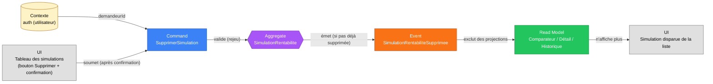

# Slice — Suppression d'une Simulation de Rentabilité

> **Mode** : Orchestration Métier (cf. `MISSION.md`). Analyse métier uniquement, pas de code.
>
> **Statut** : *Slice métier **validé**. Implémenté.*

## 1. Décisions actées

| #   | Décision                                                                                                                          |
|-----|-------------------------------------------------------------------------------------------------------------------------------------|
| D1  | **Suppression = un fait métier de plus, jamais une purge.** Cohérent avec le reste du bounded context `rentabilite` (event sourcing strict, MISSION §5) : un nouvel événement `SimulationRentabiliteSupprimee` est ajouté au flux existant. **Rien n'est jamais effacé de l'event store.** |
| D2  | **Suppression = disparition totale côté API**, pas un simple retrait de la liste. Une fois supprimée, une simulation n'est plus consultable par **aucune** route (comparateur, détail, historique) — elle se comporte comme si elle n'existait plus pour l'utilisateur, alors que son flux d'événements reste techniquement intact et rejouable en base (garantie d'audit, non exposée en V1). |
| D3  | **Pas de restauration dans ce tour.** Contrairement à la modification de simulation (qui offre « revenir à cette version »), il n'y a pas de bouton « annuler la suppression » en V1. Si le besoin apparaît, il sera couvert par un slice dédié réutilisant le même flux d'événements déjà préservé (aucune rupture à prévoir). |
| D4  | **Suppression idempotente et silencieuse.** Supprimer une simulation déjà supprimée est un no-op (aucun nouvel événement, aucune erreur) — même philosophie que le no-op de `ModifierBien` (D4 de `docs/slices/modification-bien.md`). |
| D5  | **Une simulation supprimée ne peut plus être modifiée.** `ModifierSimulationRentabiliteUseCase` doit refuser (nouvelle exception) toute tentative de modification sur une simulation déjà supprimée. |
| D6  | **Autorisation identique aux autres commandes du bounded context** : seul l'`utilisateurId` qui a lancé (ou modifié) la simulation peut la supprimer. Réutilise `DroitInsuffisantSurBienException` (déjà partagée dans `shared`). |
| D7  | **Champ `supprimee` sur l'aggregate `SimulationRentabilite`**, dérivé par rejeu (comme tous les autres champs). Permet au service de vérifier D5 sans requête supplémentaire. |

## 2. Dépendances de slices

| Slice                                       | Position    | Pourquoi                                                                              |
|----------------------------------------------|-------------|------------------------------------------------------------------------------------------|
| **Projection de Rentabilité** (amont, implémenté) | Requis      | Ce slice ajoute un événement au flux `SimulationRentabilite` déjà event-sourcé.       |

## 3. Périmètre

- **Inclus** : suppression, par l'utilisateur propriétaire, d'une simulation de rentabilité déjà lancée — accessible directement depuis la ligne du tableau « Simulations de rentabilité », avec confirmation avant l'action.
- **Exclus** : restauration d'une simulation supprimée (D3), suppression en masse, suppression d'un bien (slice distinct, hors scope ici).

## 4. Acteurs

| Acteur                          | Rôle                                                              |
|---------------------------------|---------------------------------------------------------------------|
| **Utilisateur (propriétaire)**  | Supprime une de ses propres simulations. Acteur unique (D6).        |

## 5. Diagramme Event Modeling

## 6. Command — `SupprimerSimulation`

| Champ           | Type                   | Origine          | Contraintes                                    |
|-------------------|------------------------|-------------------|--------------------------------------------------|
| `simulationId`    | `SimulationRentabiliteId` | UI (route)     | Doit référencer une simulation existante.        |
| `demandeurId`     | `UtilisateurId`        | Contexte d'auth   | Doit être l'`utilisateurId` de la simulation (D6). |

## 7. Event — `SimulationRentabiliteSupprimee`

| Champ           | Type      | Remarques                       |
|-------------------|-----------|----------------------------------|
| `simulationId`    | `UUID`    |                                  |
| `survenuLe`        | `Instant` | Horodatage technique.           |

## 8. Invariants

1. **I-SUPPR-1** `simulationId` doit référencer une simulation existante, sinon `SimulationNonTrouveeException` (réutilisée).
2. **I-SUPPR-2** `demandeurId` doit être l'`utilisateurId` de la simulation, sinon `DroitInsuffisantSurBienException` (réutilisée).
3. **I-SUPPR-3** (D4) Si la simulation est déjà supprimée : no-op silencieux, aucun événement émis.
4. **I-SUPPR-4** (D5) Une simulation supprimée refuse toute `ModifierSimulationRentabiliteCommand` — nouvelle exception `SimulationSupprimeeException`.
5. **I-SUPPR-5** (D2) Une simulation supprimée est invisible pour `ObtenirComparateurUseCase` (filtrée de la liste), `ObtenirSimulationUseCase` (détail — lève `SimulationNonTrouveeException` comme si elle n'existait pas) et `ObtenirHistoriqueSimulationUseCase` (idem).

## 9. UX (FRONTEND, pour information — pas de décision technique figée ici)

Un bouton « Supprimer » sur chaque ligne du tableau `ComparateurSimulationsPage`, avec confirmation avant envoi (ex. `window.confirm`), correspondant à la demande explicite de l'utilisateur (« une petite pop-up : Êtes-vous sûr de vouloir supprimer cette simulation ? »).

## 10. Questions résiduelles

Aucune à ce stade — voir néanmoins D2 (disparition totale vs simple retrait de liste) et D3 (pas de restauration) : si l'utilisateur préfère un comportement différent sur l'un des deux, ce sont les deux points à retrancher avant validation.

## 11. Hors périmètre

- Restauration d'une simulation supprimée (D3).
- Suppression en masse / suppression d'un bien entier.
- Purge réelle de l'event store (l'architecture Event Sourcing du projet l'exclut par construction, MISSION §5).
